# Section 1: Strategic Design—Modeling the Hotel Booking Domain

## 1.1 The Imperative of Domain-Driven Design for Complex Systems

The development of a hotel booking system presents a complex set of challenges that extend far beyond simple data storage and retrieval. The business logic encompasses intricate pricing models, dynamic room availability, multifaceted reservation policies, and interactions with many external systems. A traditional monolithic layered architecture, which organizes code by technical function (e.g., controllers, services, data access), often proves inadequate for such complexity, leading to systems that are challenging to maintain and evolve.

Domain-Driven Design (DDD) offers a more robust paradigm by placing the business domain at the center of the software development process. This approach is most beneficial when implementing systems with significant and complex business rules, as is the case with a hotel booking platform. The primary goal of DDD is to create a rich, expressive software model that accurately reflects the business's processes and terminology. This is achieved through three core principles: a steadfast focus on the core domain and its logic, basing the software design on a model of that domain, and fostering deep collaboration between technical and domain experts through a shared, unambiguous vocabulary known as the Ubiquitous Language. By adopting DDD, we ensure the resulting architecture is not only technically sound but also intrinsically aligned with the business it serves, creating a foundation for a scalable, resilient, and maintainable application.

## 1.2 Identifying the Bounded Contexts

The initial step in DDD's strategic design is to decompose the overarching domain into smaller, more manageable subdomains, each encapsulated within a Bounded Context. A Bounded Context is a well-defined boundary within which a specific domain model is consistent and valid. This partitioning is crucial for managing complexity; it allows different teams to work on distinct parts of the system autonomously and prevents the ambiguity that arises when a single term (like "Customer" or "Booking") has different meanings in different business areas.

For a comprehensive hotel booking system, analyzing the business domain reveals several distinct areas of responsibility. The following Bounded Contexts provide a logical separation of concerns, organized by MVP priority for a solo developer:

### Core Domain (MVP Essential)

- **Reservations & Booking (Core Domain) - MVP REQUIRED:** This is the heart of the application, representing the primary business value. This context is responsible for the entire lifecycle of a customer's booking journey. It manages the creation of temporary bookings, the confirmation of reservations, modifications, cancellations, and the application of various booking policies. Key entities include `Reservation`, `BookingPolicy`, `RateCalculation`, and `BookingStatus`. The most complex and critical business logic resides here, making it the core domain.

### Supporting Subdomains

- **Hotel & Room Management (Supporting Subdomain) - MVP REQUIRED:** This context acts as the inventory management system for the hotel. Its responsibilities include defining room types (e.g., 'Queen Deluxe' or 'King Suite'), individual room details, amenities, and, most critically, managing real-time room availability. Key entities include `RoomType`, `Room`, `Amenity`, and `AvailabilityCalendar`. It provides the foundational data upon which the Reservations & Booking context operates.

- **Customer Identity & Access (Supporting Subdomain) - MVP SIMPLIFIED:** This context handles basic guest registration and authentication for MVP. Advanced CRM features (loyalty programs, detailed preferences, communication history) can be deferred post-MVP. MVP entities include `Guest` and basic `GuestProfile`. Post-MVP additions: `LoyaltyAccount`, `Preferences`, `CommunicationSettings`.

- **Revenue Management (Supporting Subdomain) - POST-MVP:** This context implements dynamic pricing strategies based on demand forecasting, competitor analysis, and market conditions. For MVP, use simple fixed pricing. Post-MVP entities include `RatePlan`, `PricingRule`, `DemandForecast`, and `MarketAnalysis`. Marketing campaigns and promotional offers are deferred.

### Generic Subdomains

- **Billing & Payments (Generic Subdomain) - MVP REQUIRED:** This context acts as a thin adapter layer over third-party payment platforms (e.g., Stripe). It handles payment intent creation, webhook processing, refund requests, and invoice generation. Key entities include `PaymentIntent`, `PaymentRecord`, `RefundRequest`, and `Invoice`. Essential for processing reservations.

- **Notification & Communication (Generic Subdomain) - MVP SIMPLIFIED:** Basic email confirmations for reservations are MVP essential. Advanced features (SMS, push notifications, marketing campaigns) can be deferred. MVP entities: `NotificationTemplate`, `EmailService`. Post-MVP: `CommunicationChannel`, `MessageQueue`, `DeliveryStatus`.

- **Reporting & Analytics (Generic Subdomain) - POST-MVP:** Business intelligence capabilities can be deferred until after MVP. Focus on core booking functionality first. All entities (`Report`, `Dashboard`, `Metric`, `AnalyticsEvent`) are post-MVP.

- **External Integrations (Generic Subdomain) - POST-MVP:** Connections with online travel agencies and external APIs can be deferred. MVP focuses on direct bookings only. All entities (`ChannelMapping`, `ExternalBooking`, `SyncStatus`, `IntegrationConfig`) are post-MVP.

- **Maintenance & Housekeeping (Generic Subdomain) - POST-MVP:** Operational management features can be deferred until after core booking functionality is complete. All entities (`RoomStatus`, `CleaningTask`, `MaintenanceRequest`, `StaffAssignment`) are post-MVP.

## 1.3 Defining the Ubiquitous Language

The Ubiquitous Language is a shared vocabulary between domain experts and developers. It ensures that the same terms mean the same things to everyone involved in the project. This language should be reflected in the code, documentation, and conversations. For our hotel booking system, key terms organized by bounded context include:

### Reservations & Booking Context

- **Guest:** A person who makes a reservation or stays at the hotel
- **Reservation:** A confirmed booking for a specific room, dates, and guest
- **Booking Policy:** Rules governing reservations (cancellation, modification, no-show)
- **Rate Calculation:** The process of determining total cost including taxes and fees
- **Booking Status:** Current state of a reservation (Pending, Confirmed, Cancelled, Completed)
- **Hold Period:** Time limit for completing payment on a provisional booking

### Hotel & Room Management Context

- **Room Type:** A category of rooms with similar features (e.g., 'Deluxe King')
- **Room:** A specific physical accommodation unit with a unique identifier
- **Availability Calendar:** Real-time inventory showing bookable rooms by date
- **Amenity:** Features or services associated with rooms or hotel (Wi-Fi, Pool, Spa)
- **Occupancy Status:** Current state of a room (Vacant Clean, Occupied, Out of Order)

### Revenue Management Context

- **Rate Plan:** Pricing strategy with specific rules and restrictions
- **Dynamic Pricing:** Real-time rate adjustments based on demand and market conditions
- **RevPAR:** Revenue Per Available Room - key performance metric
- **Demand Forecast:** Predicted booking patterns and occupancy levels
- **Pricing Rule:** Automated logic for rate adjustments

### Billing & Payments Context

- **Payment Intent:** Stripe's representation of a payment attempt with specific amount and currency
- **Payment Record:** Internal record linking Stripe payment data to hotel reservations
- **Webhook Event:** Stripe's notification of payment status changes (succeeded, failed, refunded)
- **Refund Request:** Internal request to process refunds through Stripe's API
- **Invoice:** Customer-facing document summarizing charges and payment status

### Customer Identity & Access Context

- **Guest Profile:** Comprehensive record of guest information and preferences
- **Loyalty Status:** Guest's tier level in the hotel's rewards program
- **Communication Preferences:** Guest's preferred channels and frequency for contact
- **Guest History:** Record of past stays and interactions with the hotel

## 1.4 Crafting the Context Map

A Context Map is a strategic DDD tool that visualizes the relationships and integration patterns between the identified Bounded Contexts. It is not merely a technical diagram but a reflection of organizational and team dynamics, clarifying how information flows and where dependencies exist. By defining these relationships with established DDD patterns, we can design more robust and maintainable integrations.

- **Reservations & Booking and Hotel & Room Management (Customer-Supplier):** This is a classic Customer-Supplier relationship. The Hotel & Room Management context acts as the Upstream (Supplier), providing critical data like room types, details, and real-time availability. The Reservations & Booking context is the Downstream (Customer), consuming this data to perform its core functions. The downstream team's success is directly dependent on the quality and stability of the upstream service.
- **Reservations & Booking and Customer Identity & Access (Anti-Corruption Layer):** The Reservations context needs to associate a booking with a Guest, but it does not need the full complexity of the Customer model from the Customer Identity & Access context. To protect the integrity and simplicity of the Reservations model, an Anti-Corruption Layer (ACL) is employed. This layer acts as a translator, converting the rich Customer entity into a simpler, purpose-built Guest representation (likely a Value Object containing only an ID and name) for use within the Reservations context.
- **Reservations & Booking and Billing & Payments (Open Host Service & Published Language):** The Billing & Payments context exposes its functionality through an Open Host Service (OHS)—a well-defined, stable API. The communication between Reservations and Billing occurs via a Published Language, which is a shared, well-documented data format (e.g., a JSON schema for a payment request). This interaction is ideally asynchronous and event-driven. For instance, when a Reservation is confirmed, it publishes a `ReservationConfirmed` domain event. A listener can then translate this into a `ProcessPayment` command sent to the Billing context's OHS, decoupling the two systems and enhancing resilience.
- **Reservations & Booking and Revenue Management (Customer-Supplier):** Similar to the relationship with Hotel Management, this is a Customer-Supplier relationship. The Revenue Management context is Upstream, providing dynamic Rate information based on complex pricing algorithms. The Reservations & Booking context is Downstream, consuming these rates to calculate the total price for a booking.

## 1.5 Architectural Approach: The Scalable Modular Monolith

A pivotal architectural decision is the choice between a monolithic or a microservice architecture. While microservices offer scalability and team autonomy, they introduce significant operational complexity, including distributed transactions, service discovery, and network latency, which can impede initial development velocity. A traditional, non-modular monolith, on the other hand, risks becoming a "Big Ball of Mud" where logical boundaries erode over time, making the system difficult to maintain.

For this project, a Modular Monolith architecture provides the optimal balance. This approach organizes the system into well-defined, independent modules (our Bounded Contexts) within a single codebase and deployment unit. This structure delivers the development and operational simplicity of a monolith while enforcing the strong logical boundaries prescribed by DDD.

This strategy is particularly powerful when managed within a monorepo using a tool like Turborepo. Each Bounded Context can be implemented as a separate package, with explicit dependencies managed by the build system. This creates a fast and efficient initial path to production. More importantly, it establishes a clear and low-risk path to scale in the future. Because the modules are already logically decoupled, a specific module (e.g., Billing & Payments) can be cleanly extracted into a standalone microservice if its scaling needs or team structure diverge from the rest of the application. This pragmatic "monorepo-first, microservices-later" strategy mitigates the risk of premature optimization while designing for future evolution.

## 1.6 Context Map

The Context Map provides a comprehensive view of all bounded context relationships and integration patterns. The following diagram illustrates the MVP vs post-MVP bounded contexts and their key relationships:

```mermaid
graph TB
    %% MVP Required Contexts (Green)
    subgraph MVP["🚀 MVP Required Contexts"]
        RB["📋 Reservations & Booking<br/>(Core Domain)"]
        HRM["🏨 Hotel & Room Management<br/>(Supporting)"]
        CIA["👤 Customer Identity & Access<br/>(Supporting - Simplified)"]
        BP["💳 Billing & Payments<br/>(Generic - Stripe)"]
        NC["📧 Notification & Communication<br/>(Generic - Email Only)"]
    end

    %% Post-MVP Contexts (Orange)
    subgraph PostMVP["🔮 Post-MVP Contexts"]
        RM["💰 Revenue Management<br/>(Supporting)"]
        RA["📊 Reporting & Analytics<br/>(Generic)"]
        EI["🔗 External Integrations<br/>(Generic)"]
        MH["🧹 Maintenance & Housekeeping<br/>(Generic)"]
    end

    %% External Services
    subgraph External["🌐 External Services"]
        Stripe["💳 Stripe API"]
        Email["📧 Email Service"]
        OTA["🏢 Online Travel Agencies"]
    end

    %% MVP Relationships (Solid lines)
    RB ---|"Customer-Supplier"| HRM
    RB ---|"Anti-Corruption Layer"| CIA
    RB ---|"Customer-Supplier"| BP
    RB ---|"Open Host Service"| NC
    BP ---|"Anti-Corruption Layer"| Stripe
    NC ---|"Integration"| Email

    %% Post-MVP Relationships (Dashed lines)
    RB -.-|"Future: Customer-Supplier"| RM
    RA -.-|"Future: Conformist"| RB
    RA -.-|"Future: Conformist"| HRM
    RA -.-|"Future: Conformist"| BP
    EI -.-|"Future: Anti-Corruption"| HRM
    EI -.-|"Future: Integration"| OTA
    MH -.-|"Future: Customer-Supplier"| HRM

    %% Styling
    classDef mvpStyle fill:#e1f5fe,stroke:#01579b,stroke-width:3px
    classDef postMvpStyle fill:#fff3e0,stroke:#e65100,stroke-width:2px,stroke-dasharray: 5 5
    classDef externalStyle fill:#f3e5f5,stroke:#4a148c,stroke-width:2px

    class RB,HRM,CIA,BP,NC mvpStyle
    class RM,RA,EI,MH postMvpStyle
    class Stripe,Email,OTA externalStyle
```

Beyond the core relationships, several additional patterns emerge:

### Core Relationships

- **Reservations & Booking ↔ Hotel & Room Management (Customer-Supplier):** Hotel Management provides room inventory data to Reservations
- **Reservations & Booking ↔ Revenue Management (Customer-Supplier):** Revenue Management provides dynamic pricing to Reservations
- **Reservations & Booking ↔ Customer Identity & Access (Anti-Corruption Layer):** Reservations uses simplified Guest representation
- **Reservations & Booking ↔ Billing & Payments (Customer-Supplier):** Billing acts as upstream supplier, providing payment processing capabilities through Stripe integration

### Supporting Relationships

- **Billing & Payments ↔ External Integrations (Anti-Corruption Layer):** Billing context protects internal domain from Stripe's complex payment model through adapter patterns
- **Notification & Communication ↔ All Contexts (Open Host Service):** Centralized communication hub
- **Reporting & Analytics ↔ All Contexts (Conformist):** Read-only data consumption for analytics
- **External Integrations ↔ Hotel Management (Anti-Corruption Layer):** Channel manager synchronization
- **Maintenance & Housekeeping ↔ Hotel Management (Customer-Supplier):** Room status updates

### Integration Patterns Summary

- **Customer-Supplier:** Clear upstream/downstream dependencies
- **Anti-Corruption Layer:** Protecting context integrity
- **Open Host Service:** Well-defined APIs for external consumption
- **Shared Kernel:** Carefully managed shared concepts
- **Conformist:** One-way data consumption

## 1.7 MVP Development Strategy for Solo Developer

As a solo developer, focusing on MVP scope is crucial for delivering value quickly while maintaining architectural integrity. The bounded contexts have been prioritized to help you build incrementally:

### MVP Required Contexts (Build First)

1. **Reservations & Booking** - Core booking functionality
2. **Hotel & Room Management** - Basic room inventory
3. **Billing & Payments** - Stripe integration for payments
4. **Customer Identity & Access** - Simplified guest registration
5. **Notification & Communication** - Basic email confirmations

### Post-MVP Contexts (Defer Until Later)

1. **Revenue Management** - Dynamic pricing and marketing
2. **Reporting & Analytics** - Business intelligence
3. **External Integrations** - OTA connections
4. **Maintenance & Housekeeping** - Operational management

### MVP Feature Scope

- **Guest Registration**: Basic profile creation (name, email, phone)
- **Room Booking**: Select dates, room type, make reservation
- **Payment Processing**: Stripe integration for secure payments
- **Email Confirmations**: Booking confirmation emails
- **Admin Panel**: Basic room and reservation management

### Deferred Features

- Loyalty programs and CRM features
- Dynamic pricing and promotional campaigns
- Advanced analytics and reporting
- Third-party integrations (Booking.com, etc.)
- Housekeeping and maintenance workflows

## 1.8 Strategic Design Summary

This strategic design establishes the foundation for a hotel booking system using Domain-Driven Design principles. The identified bounded contexts provide clear separation of concerns while the context map defines how these contexts collaborate to deliver the core business value.

The modular monolith approach ensures that the system can start simple while maintaining the flexibility to evolve as business needs change. Each bounded context can be developed and maintained independently while still operating as a cohesive system.

### Key Strategic Decisions

1. **Core Domain Focus:** Reservations & Booking represents the primary business value and receives the most investment in domain modeling
2. **Context Boundaries:** Clear separation between hotel operations, guest management, financial transactions, and external communications
3. **Integration Patterns:** Well-defined relationships that protect context integrity while enabling necessary collaboration
4. **Ubiquitous Language:** Context-specific terminology that reflects the hotel industry's business concepts and processes
5. **MVP Prioritization:** Clear separation between essential MVP features and post-MVP enhancements for solo developer efficiency

This strategic foundation provides the necessary structure for implementing a robust hotel booking system that can adapt to changing business requirements while maintaining clear architectural boundaries.
