# 1. Strategic Design - Domain-Driven Design Foundation

## 1.1 The Imperative of Domain-Driven Design for Complex Systems

Developing a hotel booking system in Go presents complex challenges extending beyond simple data storage and retrieval. The business logic encompasses intricate pricing models, dynamic room availability, multifaceted reservation policies, and interactions with many external systems. Traditional Go applications organized by technical layers (handlers, services, repositories) often prove inadequate for such complexity.

Domain-Driven Design (DDD) offers a robust paradigm by placing the business domain at the center of the software development process. This approach leverages Go's strength in building maintainable, concurrent systems while ensuring the architecture reflects business processes and terminology through three core principles:

1. **Steadfast focus on the core domain and its logic**
2. **Basing software design on a model of that domain**
3. **Fostering collaboration between technical and domain experts through Ubiquitous Language**

Go's explicit error handling, strong typing, and composition over inheritance make it an excellent choice for DDD implementation, creating a foundation for scalable, resilient, and maintainable applications.

## 1.2 Identifying the Bounded Contexts

The initial step in DDD's strategic design is decomposing the overarching domain into smaller, manageable subdomains, each encapsulated within a Bounded Context. For a comprehensive hotel booking system, analyzing the business domain reveals several distinct areas of responsibility, organized by MVP priority:

### Core Domain (MVP Essential)

**Reservations & Booking (Core Domain) - MVP REQUIRED:**
This represents the primary business value and the heart of the application. It manages the entire lifecycle of a customer's booking journey, including creation of temporary bookings, confirmation of reservations, modifications, cancellations, and application of various booking policies.

Key Go packages:

- `internal/reservation/domain` - Core business entities
- `internal/reservation/service` - Business logic orchestration
- `internal/reservation/repository` - Data persistence abstractions

### Supporting Subdomains

**Hotel & Room Management (Supporting Subdomain) - MVP REQUIRED:**
Acts as the inventory management system for the hotel, managing room types, individual room details, amenities, and real-time room availability.

Key Go packages:

- `internal/inventory/domain` - Room and availability entities
- `internal/inventory/service` - Inventory management logic
- `internal/inventory/repository` - Inventory data persistence

**Customer Identity & Access (Supporting Subdomain) - MVP SIMPLIFIED:**
Handles basic guest registration and authentication for MVP. Advanced CRM features can be deferred post-MVP.

Key Go packages:

- `internal/guest/domain` - Guest entities and authentication
- `internal/guest/service` - Guest management logic
- `internal/guest/auth` - Authentication and authorization

**Billing & Payments (Generic Subdomain) - MVP REQUIRED:**
Thin adapter layer over third-party payment platforms (Stripe), handling payment processing, webhook events, and refund requests.

Key Go packages:

- `internal/billing/domain` - Payment entities and business rules
- `internal/billing/service` - Payment orchestration
- `internal/billing/adapter` - External payment gateway integration

**Notification & Communication (Generic Subdomain) - MVP SIMPLIFIED:**
Basic email confirmations for reservations. Advanced features (SMS, push notifications) deferred post-MVP.

Key Go packages:

- `internal/notification/domain` - Notification entities
- `internal/notification/service` - Communication orchestration
- `internal/notification/adapter` - Email service integration

### Post-MVP Contexts (Deferred)

- **Revenue Management** - Dynamic pricing and promotional campaigns
- **Reporting & Analytics** - Business intelligence capabilities
- **External Integrations** - OTA connections and third-party APIs
- **Maintenance & Housekeeping** - Operational management features

## 1.3 Defining the Ubiquitous Language

The Ubiquitous Language ensures shared vocabulary between domain experts and developers, reflected in Go code, documentation, and conversations:

### Reservations & Booking Context

- **Guest** - Person making a reservation or staying at the hotel
- **Reservation** - Confirmed booking for specific room, dates, and guest
- **BookingPolicy** - Rules governing reservations (cancellation, modification, no-show)
- **RateCalculation** - Process determining total cost including taxes and fees
- **BookingStatus** - Current reservation state (Pending, Confirmed, Cancelled, Completed)
- **HoldPeriod** - Time limit for completing payment on provisional booking

### Hotel & Room Management Context

- **RoomType** - Category of rooms with similar features (e.g., 'Deluxe King')
- **Room** - Specific physical accommodation unit with unique identifier
- **AvailabilityCalendar** - Real-time inventory showing bookable rooms by date
- **Amenity** - Features or services associated with rooms or hotel
- **OccupancyStatus** - Current room state (Vacant Clean, Occupied, Out of Order)

### Billing & Payments Context

- **PaymentIntent** - Stripe's representation of payment attempt
- **PaymentRecord** - Internal record linking Stripe payment data to reservations
- **WebhookEvent** - Stripe's notification of payment status changes
- **RefundRequest** - Internal request to process refunds through Stripe's API
- **Invoice** - Customer-facing document summarizing charges and payment status

## 1.4 Context Map and Integration Patterns

The Context Map visualizes relationships and integration patterns between Bounded Contexts:

```mermaid
graph TB
    %% MVP Required Contexts
    subgraph MVP["🚀 MVP Required Contexts"]
        RB["📋 Reservations & Booking<br/>(Core Domain)"]
        HRM["🏨 Hotel & Room Management<br/>(Supporting)"]
        CIA["👤 Customer Identity & Access<br/>(Supporting - Simplified)"]
        BP["💳 Billing & Payments<br/>(Generic - Stripe)"]
        NC["📧 Notification & Communication<br/>(Generic - Email Only)"]
    end

    %% Post-MVP Contexts
    subgraph PostMVP["🔮 Post-MVP Contexts"]
        RM["💰 Revenue Management<br/>(Supporting)"]
        RA["📊 Reporting & Analytics<br/>(Generic)"]
        EI["🔗 External Integrations<br/>(Generic)"]
        MH["🧹 Maintenance & Housekeeping<br/>(Generic)"]
    end

    %% External Services
    subgraph External["🌐 External Services"]
        Stripe["💳 Stripe API"]
        Email["📧 Email Service"]
        OTA["🏢 Online Travel Agencies"]
    end

    %% MVP Relationships
    RB ---|"Customer-Supplier"| HRM
    RB ---|"Anti-Corruption Layer"| CIA
    RB ---|"Customer-Supplier"| BP
    RB ---|"Open Host Service"| NC
    BP ---|"Anti-Corruption Layer"| Stripe
    NC ---|"Integration"| Email

    %% Post-MVP Relationships (Dashed lines)
    RB -.-|"Future: Customer-Supplier"| RM
    RA -.-|"Future: Conformist"| RB
    EI -.-|"Future: Integration"| OTA

    classDef mvpStyle fill:#e1f5fe,stroke:#01579b,stroke-width:3px
    classDef postMvpStyle fill:#fff3e0,stroke:#e65100,stroke-width:2px,stroke-dasharray: 5 5
    classDef externalStyle fill:#f3e5f5,stroke:#4a148c,stroke-width:2px

    class RB,HRM,CIA,BP,NC mvpStyle
    class RM,RA,EI,MH postMvpStyle
    class Stripe,Email,OTA externalStyle
```



### Domain Events Strategy

Domain events serve as the primary integration mechanism between bounded contexts, enabling loose coupling while maintaining business consistency across the system.

**Event Types by Context:**

- **Reservations**: ReservationCreated, ReservationConfirmed, ReservationCancelled, ReservationModified, GuestInfoUpdated
- **Inventory**: RoomAvailabilityChanged, RoomTypeUpdated, RoomStatusChanged, MaintenanceScheduled
- **Billing**: PaymentProcessed, PaymentFailed, RefundIssued, InvoiceGenerated
- **Guest**: GuestRegistered, GuestProfileUpdated, GuestPreferencesChanged
- **Notification**: EmailSent, SMSDelivered, NotificationFailed

**Event Flow Patterns:**

- **Reservation → Billing**: Trigger payment processing when reservation is confirmed
- **Reservation → Notification**: Send confirmation emails and booking updates
- **Reservation → Inventory**: Update room availability and occupancy status
- **Billing → Notification**: Send payment confirmations and receipts
- **Guest → Reservation**: Update existing reservations when guest profile changes
- **Inventory → Reservation**: Notify about room changes affecting existing bookings

**Event Processing Guarantees:**

- **At-least-once delivery**: Using outbox pattern with retry mechanisms
- **Idempotent handlers**: All event handlers designed to handle duplicate events safely
- **Eventual consistency**: Cross-context data synchronization within acceptable time windows
- **Event ordering**: Critical events processed in sequence using event versioning

**Event Schema Evolution:**

- **Backward compatibility**: New event versions maintain compatibility with existing handlers
- **Graceful degradation**: Unknown event fields ignored by older handlers
- **Version migration**: Automatic event transformation between schema versions

### Key Integration Patterns

**Customer-Supplier Relationships:**

- Reservations & Booking ↔ Hotel & Room Management
- Reservations & Booking ↔ Billing & Payments
- Reservations & Booking ↔ Customer Identity & Access

**Anti-Corruption Layers:**

- Billing & Payments ↔ Stripe API (protecting internal domain from external complexity)
- Customer Identity ↔ Reservations (simplified guest representation)

**Open Host Service:**

- Notification & Communication ↔ All Contexts (centralized communication hub)

## 1.5 Architectural Approach: The Go Modular Monolith

For this project, a **Modular Monolith** architecture provides optimal balance, organizing the system into well-defined, independent modules (Bounded Contexts) within a single Go binary. This approach delivers development and operational simplicity while enforcing strong logical boundaries prescribed by DDD.

**Go Module Structure Benefits:**

- Single `go.mod` file for dependency management
- Clear package boundaries enforcing context isolation
- Efficient compilation and deployment as single binary
- Easy extraction to microservices when needed
- Excellent performance through Go's runtime efficiency

**Concurrency and Race Condition Handling:**

- Optimistic locking for reservation conflicts
- Event sourcing for audit trails
- Circuit breaker patterns for external services
- Distributed locking for inventory management

The structure follows Go's standard project layout with DDD principles:

```text
hotel-booking-system/
├── cmd/                      # Application entry points
├── internal/                 # Private application code
│   ├── reservation/          # Reservations & Booking context
│   ├── inventory/            # Hotel & Room Management context
│   ├── guest/                # Customer Identity & Access context
│   ├── billing/              # Billing & Payments context
│   ├── notification/         # Notification & Communication context
│   └── shared/               # Shared domain concepts
├── pkg/                      # Public library code
├── api/                      # API definitions (OpenAPI, gRPC)
├── web/                      # Web application files
├── configs/                  # Configuration files
├── scripts/                  # Build and deployment scripts
├── docs/                     # Documentation
└── go.mod                    # Go module definition
```

This strategy is particularly powerful because:

1. **Development Simplicity**: Single codebase and deployment unit
2. **Strong Boundaries**: Go packages enforce context isolation
3. **Performance**: Single binary with efficient Go runtime
4. **Future-Proof**: Clear path to microservices extraction
5. **Team Efficiency**: Ideal for solo developer or small team
