# Section 1: Strategic Design—Modeling the Hotel Booking Domain

## 1.1 The Imperative of Domain-Driven Design for Complex Systems

The development of a hotel booking system presents complex business challenges that extend far beyond simple data storage and retrieval. The business logic encompasses intricate pricing models, dynamic room availability, multifaceted reservation policies, and interactions with numerous external systems. A traditional monolithic layered architecture, which organizes code by technical function, often proves inadequate for such complexity, leading to systems that are challenging to maintain and evolve.

Domain-Driven Design (DDD) offers a more robust paradigm by placing the business domain at the center of the software development process. This approach is most beneficial when implementing systems with significant and complex business rules, as is the case with a hotel booking platform. The primary goal of DDD is to create a rich, expressive software model that accurately reflects the business's processes and terminology through three core principles:

1. **Steadfast focus on the core domain and its logic**
2. **Basing software design on a model of that domain**
3. **Fostering deep collaboration between technical and domain experts through Ubiquitous Language**

By adopting DDD, we ensure the resulting architecture is not only technically sound but also intrinsically aligned with the business it serves, creating a foundation for a scalable, resilient, and maintainable application.

## 1.2 Identifying the Bounded Contexts

The initial step in DDD's strategic design is to decompose the overarching domain into smaller, more manageable subdomains, each encapsulated within a Bounded Context. A Bounded Context is a well-defined boundary within which a specific domain model is consistent and valid.

For our hotel booking system, analyzing the business domain reveals several distinct areas of responsibility, organized by MVP priority:

### Core Domain (MVP Essential)

**Reservations & Booking (Core Domain) - MVP REQUIRED**
This is the heart of the application, representing the primary business value. This context manages the entire lifecycle of a customer's booking journey, from initial reservation creation through confirmation, modifications, and cancellations. It encapsulates complex business rules around booking policies, rate calculations, and reservation status management.

_Key Entities:_ `ReservationAggregate`, `RoomBooking`, `BookingPolicy`
_Key Value Objects:_ `DateRange`, `ConfirmationNumber`, `ReservationStatus`
_Key Services:_ `BookingPolicyService`, `RateCalculatorService`

### Supporting Subdomains (MVP Required)

**Hotel & Room Management (Supporting Subdomain) - MVP REQUIRED**
This context acts as the inventory management system for the hotel. It manages room types, individual room details, amenities, and most critically, real-time room availability. It provides the foundational data upon which the Reservations context operates.

_Key Entities:_ `RoomType`, `Room`, `AvailabilityCalendar`
_Key Value Objects:_ `RoomNumber`, `OccupancyStatus`, `RoomFeatures`
_Key Services:_ `AvailabilityCalculatorService`, `RoomAssignmentService`

**Billing & Payments (Supporting Subdomain) - MVP REQUIRED**
This context handles payment processing with hotel-specific business rules including deposit policies, refund calculations, and tax handling. It integrates with external payment gateways while maintaining domain-specific payment logic.

_Key Entities:_ `PaymentAggregate`, `Invoice`, `RefundRequest`
_Key Value Objects:_ `PaymentMethod`, `PaymentStatus`, `Money`
_Key Services:_ `PaymentPolicyService`, `RefundCalculatorService`

**Customer Identity & Access (Supporting Subdomain) - MVP SIMPLIFIED**
This context handles basic guest registration and authentication for MVP. Advanced CRM features are deferred post-MVP.

_MVP Entities:_ `Guest`, `GuestProfile`
_Post-MVP Additions:_ `LoyaltyAccount`, `Preferences`, `CommunicationSettings`

### Generic Subdomains

**Notification & Communication (Generic Subdomain) - MVP SIMPLIFIED**
Basic email confirmations for reservations are MVP essential. Advanced communication features are deferred.

_MVP Entities:_ `NotificationTemplate`, `EmailService`
_Post-MVP:_ `CommunicationChannel`, `MessageQueue`, `DeliveryStatus`

### Post-MVP Contexts (Deferred)

**Revenue Management (Supporting Subdomain) - POST-MVP**
Dynamic pricing strategies, demand forecasting, and promotional campaigns.

**Reporting & Analytics (Generic Subdomain) - POST-MVP**
Business intelligence and performance analytics.

**External Integrations (Generic Subdomain) - POST-MVP**
OTA connections and third-party API integrations.

**Maintenance & Housekeeping (Generic Subdomain) - POST-MVP**
Operational management and room status tracking.

## 1.3 Defining the Ubiquitous Language

The Ubiquitous Language is a shared vocabulary between domain experts and developers, reflected in code, documentation, and conversations.

### Reservations & Booking Context

- **Guest:** A person who makes a reservation or stays at the hotel
- **Reservation:** A confirmed booking for specific room(s), dates, and guest(s)
- **Booking Policy:** Rules governing reservations (cancellation, modification, no-show)
- **Rate Calculation:** Process of determining total cost including taxes and fees
- **Confirmation Number:** Unique identifier for a completed reservation
- **Hold Period:** Time limit for completing payment on a provisional booking

### Hotel & Room Management Context

- **Room Type:** Category of rooms with similar features (e.g., 'Deluxe King')
- **Room:** Specific physical accommodation unit with unique identifier
- **Availability Calendar:** Real-time inventory showing bookable rooms by date
- **Occupancy Status:** Current state of a room (Vacant Clean, Occupied, Out of Order)
- **Room Block:** Group of rooms reserved for events or group bookings

### Billing & Payments Context

- **Payment Intent:** Representation of a payment attempt with specific amount
- **Payment Record:** Internal record linking external payment data to reservations
- **Refund Policy:** Business rules governing refund eligibility and amounts
- **Deposit Requirement:** Advance payment rules based on booking characteristics
- **Tax Calculation:** Location and service-specific tax computation

## 1.4 Context Map

The Context Map visualizes relationships and integration patterns between bounded contexts using established DDD patterns.

```mermaid
graph TB
    %% Core Domain
    subgraph "🎯 Core Domain (MVP)"
        RES["📋 Reservations & Booking<br/>(Core Domain)"]
    end

    %% Supporting Domains
    subgraph "🔧 Supporting Domains (MVP)"
        INV["🏨 Hotel & Room Management<br/>(Supporting)"]
        BILL["💳 Billing & Payments<br/>(Supporting)"]
        GUEST["👤 Customer Identity<br/>(Supporting)"]
    end

    %% Generic Domains
    subgraph "⚙️ Generic Domains (MVP)"
        NOTIF["📧 Notifications<br/>(Generic)"]
    end

    %% Shared Kernel
    subgraph "🔗 Shared Kernel"
        SHARED["Shared Domain Concepts<br/>(Guest ID, Money, DateRange, Room Type ID)"]
    end

    %% Post-MVP Contexts
    subgraph "🔮 Post-MVP Contexts"
        REV["💰 Revenue Management"]
        ANALYTICS["📊 Analytics & Reporting"]
        INTEGRATIONS["🔗 External Integrations"]
        OPS["🧹 Operations & Housekeeping"]
    end

    %% External Services
    subgraph "🌐 External Services"
        STRIPE["💳 Stripe API"]
        EMAIL["📧 Email Service"]
        OTA["🏢 OTA Platforms"]
    end

    %% MVP Relationships (Solid lines)
    RES ---|"Customer-Supplier<br/>(Room Availability)"| INV
    RES ---|"Customer-Supplier<br/>(Payment Processing)"| BILL
    RES ---|"Shared Kernel<br/>(Guest Identity)"| GUEST
    RES ---|"Publisher-Subscriber<br/>(Integration Events)"| NOTIF

    %% Shared Kernel relationships
    RES -.- SHARED
    INV -.- SHARED
    BILL -.- SHARED
    GUEST -.- SHARED

    %% External integrations (MVP)
    BILL ---|"Anti-Corruption Layer"| STRIPE
    NOTIF ---|"Adapter Pattern"| EMAIL

    %% Post-MVP Relationships (Dashed lines)
    RES -.-|"Future: Customer-Supplier"| REV
    ANALYTICS -.-|"Future: Conformist"| RES
    ANALYTICS -.-|"Future: Conformist"| BILL
    INTEGRATIONS -.-|"Future: Anti-Corruption"| OTA
    OPS -.-|"Future: Customer-Supplier"| INV

    %% Styling
    classDef core fill:#e1f5fe,stroke:#01579b,stroke-width:4px
    classDef supporting fill:#f3e5f5,stroke:#4a148c,stroke-width:3px
    classDef generic fill:#fff3e0,stroke:#e65100,stroke-width:2px
    classDef shared fill:#e8f5e8,stroke:#2e7d32,stroke-width:2px
    classDef postMvp fill:#fce4ec,stroke:#880e4f,stroke-width:2px,stroke-dasharray: 5 5
    classDef external fill:#f1f8e9,stroke:#33691e,stroke-width:2px

    class RES core
    class INV,BILL,GUEST supporting
    class NOTIF generic
    class SHARED shared
    class REV,ANALYTICS,INTEGRATIONS,OPS postMvp
    class STRIPE,EMAIL,OTA external
```

### Integration Pattern Descriptions

**Customer-Supplier Pattern:**

- **Reservations ↔ Hotel Management:** Reservations (customer) depends on room availability data from Hotel Management (supplier)
- **Reservations ↔ Billing:** Reservations (customer) initiates payment requests to Billing (supplier)

**Shared Kernel Pattern:**

- **Core Value Objects:** `GuestId`, `Money`, `DateRange`, `RoomTypeId` shared across contexts
- **Common Events:** `DomainEvent` base classes and integration event contracts

**Publisher-Subscriber Pattern:**

- **Event-Driven Communication:** Contexts publish integration events for loose coupling
- **Asynchronous Processing:** Non-blocking communication between contexts

**Anti-Corruption Layer Pattern:**

- **External Service Integration:** Protecting domain from external API complexities
- **Translation Layer:** Converting between domain models and external formats

## 1.5 Architectural Approach: The Scalable Modular Monolith

A pivotal architectural decision is choosing between monolithic or microservice architecture. While microservices offer scalability and team autonomy, they introduce significant operational complexity that can impede initial development velocity. A traditional monolith risks becoming a "Big Ball of Mud" where logical boundaries erode over time.

For this project, a **Modular Monolith** architecture provides the optimal balance. This approach organizes the system into well-defined, independent modules (our Bounded Contexts) within a single codebase and deployment unit, delivering the development simplicity of a monolith while enforcing strong logical boundaries prescribed by DDD.

### Key Benefits

1. **Development Simplicity:** Single codebase, unified build process, simplified debugging
2. **Operational Simplicity:** Single deployment unit, unified monitoring, simpler infrastructure
3. **Strong Boundaries:** Clear module separation prevents architectural erosion
4. **Future Flexibility:** Clean extraction path to microservices when needed
5. **Solo Developer Friendly:** Reduced complexity for initial development and deployment

### Monorepo Structure with Turborepo

Using Turborepo for monorepo management provides:

- **Fast Builds:** Intelligent caching and parallel execution
- **Clear Dependencies:** Explicit package dependencies
- **Independent Development:** Contexts developed as separate packages
- **Scalable Architecture:** Foundation for future microservice extraction

## 1.6 MVP Development Strategy

### MVP Scope Definition

#### Phase 1: Core Booking Flow (Weeks 1-3)

- Basic room search and availability checking
- Simple reservation creation and confirmation
- Fixed pricing (no dynamic rates)
- Direct bookings only (no external channels)

#### Phase 2: Payment & Guest Management (Weeks 4-5)

- Stripe payment integration
- Basic guest registration and authentication
- Email confirmation notifications
- Simple cancellation handling

#### Phase 3: Admin Interface (Week 6)

- Room and room type management
- Reservation management dashboard
- Basic reporting (reservation list, occupancy)

### Deferred to Post-MVP

- Dynamic pricing and revenue management
- Advanced guest preferences and loyalty programs
- OTA integrations and channel management
- Housekeeping and operational workflows
- Advanced analytics and business intelligence
- Marketing campaigns and promotional pricing

### Development Priorities

1. **Core Domain First:** Focus on Reservations & Booking context
2. **Essential Integrations:** Room availability and payment processing
3. **Minimum Viable Features:** Basic functionality over advanced features
4. **Technical Debt Management:** Build for current needs, design for future evolution
