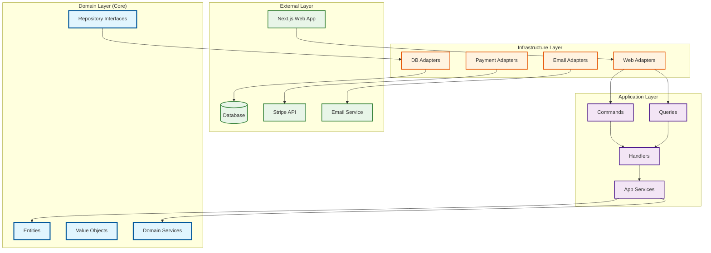

# Section 3: Structure Blueprint—DDD & Hexagonal Architecture Implementation

## 3.1 Architecture Overview

This blueprint synthesizes Domain-Driven Design (DDD) strategic patterns with Hexagonal Architecture (Ports & Adapters) tactical implementation. The result is a modular monolith that maintains clear boundaries between business logic and external concerns while supporting future evolution to microservices.

### Core Architectural Principles

1. **Domain-Centric Design**: Business logic isolated in the domain layer
2. **Dependency Inversion**: Domain depends only on abstractions, never on concrete implementations
3. **Hexagonal Boundaries**: Clear separation between core business logic and external adapters
4. **Bounded Context Isolation**: Each context maintains its own domain model and boundaries
5. **MVP-First Approach**: Incremental development focusing on core business value

## 3.2 Hexagonal Architecture Layers

```mermaid
graph TB
    subgraph "External World"
        UI[Web UI<br/>Next.js]
        API[REST/tRPC APIs]
        DB[(PostgreSQL<br/>Database)]
        Stripe[Stripe<br/>Payment Gateway]
        Email[Email<br/>Service]
        OTA[OTA<br/>Platforms]
    end

    subgraph "Hexagonal Architecture"
        subgraph "Adapters (Infrastructure)"
            WebAdapter[Web Adapter]
            APIAdapter[API Adapter]
            DBAdapter[Database Adapter]
            PaymentAdapter[Payment Adapter]
            EmailAdapter[Email Adapter]
            OTAAdapter[OTA Adapter]
        end

        subgraph "Ports (Interfaces)"
            WebPort[Web Port]
            APIPort[API Port]
            RepoPort[Repository Port]
            PaymentPort[Payment Port]
            NotificationPort[Notification Port]
            IntegrationPort[Integration Port]
        end

        subgraph "Application Layer"
            UseCases[Use Cases<br/>Command/Query Handlers]
            AppServices[Application Services]
            EventHandlers[Domain Event Handlers]
        end

        subgraph "Domain Layer (Core)"
            Entities[Entities & Aggregates]
            ValueObjects[Value Objects]
            DomainServices[Domain Services]
            DomainEvents[Domain Events]
            Repositories[Repository Interfaces]
        end
    end

    UI --> WebAdapter
    API --> APIAdapter
    WebAdapter --> WebPort
    APIAdapter --> APIPort

    WebPort --> UseCases
    APIPort --> UseCases
    UseCases --> Entities
    UseCases --> DomainServices

    Repositories --> RepoPort
    RepoPort --> DBAdapter
    DBAdapter --> DB

    PaymentPort --> PaymentAdapter
    PaymentAdapter --> Stripe

    NotificationPort --> EmailAdapter
    EmailAdapter --> Email

    IntegrationPort --> OTAAdapter
    OTAAdapter --> OTA

    classDef domain fill:#e1f5fe,stroke:#01579b,stroke-width:3px
    classDef application fill:#f3e5f5,stroke:#4a148c,stroke-width:2px
    classDef infrastructure fill:#fff3e0,stroke:#e65100,stroke-width:2px
    classDef external fill:#e8f5e8,stroke:#2e7d32,stroke-width:2px

    class Entities,ValueObjects,DomainServices,DomainEvents,Repositories domain
    class UseCases,AppServices,EventHandlers application
    class WebAdapter,APIAdapter,DBAdapter,PaymentAdapter,EmailAdapter,OTAAdapter infrastructure
    class UI,API,DB,Stripe,Email,OTA external
```



## 3.3 Bounded Context Implementation Structure

Each bounded context follows the same hexagonal structure while maintaining clear boundaries:

### 3.3.1 Reservations & Booking Context (Core Domain)

```text
core/reservations/                    # @hotel/reservations
├── domain/                           # Domain Layer (Inner Hexagon)
│   ├── entities/
│   │   ├── reservation.entity.ts     # Reservation Aggregate Root
│   │   ├── booking.entity.ts         # Booking Entity
│   │   └── index.ts
│   ├── value-objects/
│   │   ├── date-range.vo.ts          # Check-in/Check-out dates
│   │   ├── guest-info.vo.ts          # Guest contact information
│   │   ├── confirmation-number.vo.ts # Unique booking identifier
│   │   ├── booking-status.vo.ts      # Reservation status enum
│   │   ├── rate-calculation.vo.ts    # Pricing calculation
│   │   └── index.ts
│   ├── services/
│   │   ├── booking-policy.service.ts # Business rules for bookings
│   │   ├── rate-calculator.service.ts # Pricing logic
│   │   ├── availability-checker.service.ts # Room availability
│   │   └── index.ts
│   ├── events/
│   │   ├── booking-created.event.ts  # Domain event
│   │   ├── booking-confirmed.event.ts
│   │   ├── booking-cancelled.event.ts
│   │   └── index.ts
│   ├── repositories/                 # Repository Interfaces (Ports)
│   │   ├── reservation.repository.ts
│   │   ├── booking.repository.ts
│   │   └── index.ts
│   └── index.ts
├── application/                      # Application Layer
│   ├── commands/
│   │   ├── create-reservation.command.ts
│   │   ├── confirm-booking.command.ts
│   │   ├── cancel-booking.command.ts
│   │   └── index.ts
│   ├── queries/
│   │   ├── get-reservation.query.ts
│   │   ├── list-bookings.query.ts
│   │   └── index.ts
│   ├── handlers/
│   │   ├── create-reservation.handler.ts
│   │   ├── confirm-booking.handler.ts
│   │   ├── cancel-booking.handler.ts
│   │   ├── get-reservation.handler.ts
│   │   └── index.ts
│   ├── services/
│   │   ├── reservation.service.ts    # Application Service
│   │   └── index.ts
│   ├── ports/                        # Application Ports
│   │   ├── payment.port.ts           # Payment processing interface
│   │   ├── notification.port.ts      # Email notification interface
│   │   ├── room-availability.port.ts # Room inventory interface
│   │   └── index.ts
│   └── index.ts
├── infrastructure/                   # Infrastructure Layer (Adapters)
│   ├── adapters/
│   │   ├── database/
│   │   │   ├── reservation.adapter.ts # Database adapter
│   │   │   ├── booking.adapter.ts
│   │   │   └── index.ts
│   │   ├── external/
│   │   │   ├── payment.adapter.ts    # Stripe integration
│   │   │   ├── notification.adapter.ts # Email service
│   │   │   └── index.ts
│   │   └── index.ts
│   ├── schemas/
│   │   ├── reservation.schema.ts     # Database schema
│   │   ├── booking.schema.ts
│   │   └── index.ts
│   └── index.ts
└── index.ts                          # Context public interface
```

### 3.3.2 Hotel & Room Management Context (Supporting)

```text
core/inventory/                       # @hotel/inventory
├── domain/                           # Domain Layer
│   ├── entities/
│   │   ├── room-type.entity.ts       # Room Type Aggregate Root
│   │   ├── room.entity.ts            # Individual Room Entity
│   │   ├── amenity.entity.ts         # Hotel Amenities
│   │   └── index.ts
│   ├── value-objects/
│   │   ├── room-number.vo.ts         # Room identifier
│   │   ├── occupancy-status.vo.ts    # Room status
│   │   ├── room-features.vo.ts       # Room characteristics
│   │   ├── pricing-info.vo.ts        # Base pricing
│   │   └── index.ts
│   ├── services/
│   │   ├── availability-calendar.service.ts # Room availability logic
│   │   ├── room-assignment.service.ts # Room allocation
│   │   └── index.ts
│   ├── events/
│   │   ├── room-status-changed.event.ts
│   │   ├── availability-updated.event.ts
│   │   └── index.ts
│   ├── repositories/
│   │   ├── room-type.repository.ts
│   │   ├── room.repository.ts
│   │   ├── availability.repository.ts
│   │   └── index.ts
│   └── index.ts
├── application/                      # Application Layer
│   ├── commands/
│   │   ├── create-room-type.command.ts
│   │   ├── update-room-status.command.ts
│   │   ├── block-rooms.command.ts
│   │   └── index.ts
│   ├── queries/
│   │   ├── get-available-rooms.query.ts
│   │   ├── get-room-types.query.ts
│   │   └── index.ts
│   ├── handlers/
│   │   ├── room-management.handlers.ts
│   │   ├── availability.handlers.ts
│   │   └── index.ts
│   ├── services/
│   │   ├── room-management.service.ts
│   │   └── index.ts
│   ├── ports/
│   │   ├── housekeeping.port.ts      # Future: Housekeeping integration
│   │   └── index.ts
│   └── index.ts
├── infrastructure/                   # Infrastructure Layer
│   ├── adapters/
│   │   ├── database/
│   │   │   ├── room-type.adapter.ts
│   │   │   ├── room.adapter.ts
│   │   │   ├── availability.adapter.ts
│   │   │   └── index.ts
│   │   └── index.ts
│   ├── schemas/
│   │   ├── room-type.schema.ts
│   │   ├── room.schema.ts
│   │   ├── availability.schema.ts
│   │   └── index.ts
│   └── index.ts
└── index.ts
```

### 3.3.3 Customer Identity & Access Context (Supporting)

```text
core/guests/                          # @hotel/guests
├── domain/                           # Domain Layer
│   ├── entities/
│   │   ├── guest.entity.ts           # Guest Aggregate Root
│   │   ├── guest-profile.entity.ts   # Guest Profile Entity
│   │   └── index.ts
│   ├── value-objects/
│   │   ├── guest-id.vo.ts            # Guest identifier
│   │   ├── contact-info.vo.ts        # Contact information
│   │   ├── preferences.vo.ts         # Guest preferences
│   │   └── index.ts
│   ├── services/
│   │   ├── authentication.service.ts # Authentication logic
│   │   └── index.ts
│   ├── events/
│   │   ├── guest-registered.event.ts
│   │   ├── profile-updated.event.ts
│   │   └── index.ts
│   ├── repositories/
│   │   ├── guest.repository.ts
│   │   └── index.ts
│   └── index.ts
├── application/                      # Application Layer
│   ├── commands/
│   │   ├── register-guest.command.ts
│   │   ├── update-profile.command.ts
│   │   └── index.ts
│   ├── queries/
│   │   ├── get-guest.query.ts
│   │   ├── authenticate-guest.query.ts
│   │   └── index.ts
│   ├── handlers/
│   │   ├── guest-management.handlers.ts
│   │   └── index.ts
│   ├── services/
│   │   ├── guest-management.service.ts
│   │   └── index.ts
│   └── index.ts
├── infrastructure/                    # Infrastructure Layer
│   ├── adapters/
│   │   ├── database/
│   │   │   ├── guest.adapter.ts
│   │   │   └── index.ts
│   │   └── index.ts
│   ├── schemas/
│   │   ├── guest.schema.ts
│   │   └── index.ts
│   └── index.ts
└── index.ts
```

### 3.3.4 Billing & Payments Context (Supporting)

```text
core/billing/                         # @hotel/billing
├── domain/                           # Domain Layer
│   ├── entities/
│   │   ├── payment.entity.ts         # Payment Aggregate Root
│   │   ├── invoice.entity.ts         # Invoice Entity
│   │   └── index.ts
│   ├── value-objects/
│   │   ├── payment-method.vo.ts      # Payment method details
│   │   ├── payment-status.vo.ts      # Payment status
│   │   ├── amount.vo.ts              # Money amount
│   │   └── index.ts
│   ├── services/
│   │   ├── payment-processing.service.ts # Payment logic
│   │   └── index.ts
│   ├── events/
│   │   ├── payment-processed.event.ts
│   │   ├── payment-failed.event.ts
│   │   └── index.ts
│   ├── repositories/
│   │   ├── payment.repository.ts
│   │   └── index.ts
│   └── index.ts
├── application/                      # Application Layer
│   ├── commands/
│   │   ├── process-payment.command.ts
│   │   ├── refund-payment.command.ts
│   │   └── index.ts
│   ├── queries/
│   │   ├── get-payment.query.ts
│   │   └── index.ts
│   ├── handlers/
│   │   ├── payment.handlers.ts
│   │   └── index.ts
│   ├── services/
│   │   ├── payment.service.ts
│   │   └── index.ts
│   ├── ports/
│   │   ├── payment-gateway.port.ts   # Stripe integration interface
│   │   └── index.ts
│   └── index.ts
├── infrastructure/                   # Infrastructure Layer
│   ├── adapters/
│   │   ├── database/
│   │   │   ├── payment.adapter.ts
│   │   │   └── index.ts
│   │   ├── stripe/
│   │   │   ├── stripe.adapter.ts     # Stripe payment gateway
│   │   │   └── index.ts
│   │   └── index.ts
│   ├── schemas/
│   │   ├── payment.schema.ts
│   │   └── index.ts
│   └── index.ts
└── index.ts
```

### 3.3.5 Notification & Communication Context (Supporting)

```text
core/notifications/                   # @hotel/notifications
├── domain/                           # Domain Layer
│   ├── entities/
│   │   ├── notification.entity.ts    # Notification Aggregate Root
│   │   └── index.ts
│   ├── value-objects/
│   │   ├── notification-type.vo.ts   # Email, SMS, etc.
│   │   ├── recipient.vo.ts           # Recipient details
│   │   └── index.ts
│   ├── services/
│   │   ├── notification.service.ts   # Notification logic
│   │   └── index.ts
│   ├── events/
│   │   ├── notification-sent.event.ts
│   │   └── index.ts
│   ├── repositories/
│   │   ├── notification.repository.ts
│   │   └── index.ts
│   └── index.ts
├── application/                      # Application Layer
│   ├── commands/
│   │   ├── send-notification.command.ts
│   │   └── index.ts
│   ├── queries/
│   │   ├── get-notification-history.query.ts
│   │   └── index.ts
│   ├── handlers/
│   │   ├── notification.handlers.ts
│   │   └── index.ts
│   ├── services/
│   │   ├── notification.service.ts
│   │   └── index.ts
│   ├── ports/
│   │   ├── email-service.port.ts     # Email service interface
│   │   └── index.ts
│   └── index.ts
├── infrastructure/                    # Infrastructure Layer
│   ├── adapters/
│   │   ├── database/
│   │   │   ├── notification.adapter.ts
│   │   │   └── index.ts
│   │   ├── email/
│   │   │   ├── email.adapter.ts      # Email service adapter
│   │   │   ├── templates/
│   │   │   └── index.ts
│   │   └── index.ts
│   ├── schemas/
│   │   ├── notification.schema.ts
│   │   └── index.ts
│   └── index.ts
└── index.ts
```

## 3.4 Cross-Cutting Concerns & Shared Infrastructure

### 3.4.1 Shared Kernel Structure

```text
core/shared/                          # @hotel/shared
├── domain/                           # Shared Domain Concepts
│   ├── value-objects/
│   │   ├── money.vo.ts               # Currency and amount
│   │   ├── email.vo.ts               # Email address validation
│   │   ├── phone.vo.ts               # Phone number validation
│   │   ├── address.vo.ts             # Physical address
│   │   └── index.ts
│   ├── events/
│   │   ├── domain-event.base.ts      # Base domain event
│   │   ├── event-dispatcher.ts       # Event handling
│   │   └── index.ts
│   ├── exceptions/
│   │   ├── domain.exception.ts       # Domain-specific errors
│   │   ├── validation.exception.ts   # Validation errors
│   │   └── index.ts
│   └── index.ts
├── application/                      # Shared Application Patterns
│   ├── cqrs/
│   │   ├── command.base.ts           # Base command interface
│   │   ├── query.base.ts             # Base query interface
│   │   ├── handler.base.ts           # Base handler interface
│   │   └── index.ts
│   ├── validation/
│   │   ├── validator.service.ts      # Zod validation service
│   │   └── index.ts
│   └── index.ts
└── index.ts
```

### 3.4.2 Infrastructure Packages Structure

```text
packages/
├── database/                         # @hotel/database
│   ├── schemas/
│   │   ├── reservations.schema.ts    # Drizzle schemas per context
│   │   ├── rooms.schema.ts
│   │   ├── guests.schema.ts
│   │   ├── payments.schema.ts
│   │   └── index.ts
│   ├── migrations/
│   │   ├── 001_initial_schema.sql
│   │   ├── 002_add_payments.sql
│   │   └── index.ts
│   ├── connection.ts                 # Database connection
│   └── index.ts
├── api/                              # @hotel/api
│   ├── routers/
│   │   ├── reservations.router.ts    # tRPC routers per context
│   │   ├── rooms.router.ts
│   │   ├── guests.router.ts
│   │   ├── payments.router.ts
│   │   └── index.ts
│   ├── middleware/
│   │   ├── auth.middleware.ts        # Authentication
│   │   ├── validation.middleware.ts  # Request validation
│   │   └── index.ts
│   ├── root.router.ts                # Main tRPC router
│   └── index.ts
├── auth/                             # @hotel/auth (better-auth)
│   ├── auth.config.ts                # better-auth configuration
│   ├── providers/                    # Authentication providers
│   │   ├── credentials.provider.ts   # Email/password provider
│   │   ├── google.provider.ts        # Google OAuth provider
│   │   └── index.ts
│   ├── middleware.ts                 # Auth middleware
│   ├── types.ts                      # Auth-related types
│   └── index.ts
├── adapters/                         # @hotel/adapters
│   ├── stripe/
│   │   ├── stripe.adapter.ts         # Stripe payment adapter
│   │   ├── webhook.handler.ts        # Stripe webhook handling
│   │   └── index.ts
│   ├── email/
│   │   ├── email.adapter.ts          # Email service adapter
│   │   ├── templates/                # Email templates
│   │   └── index.ts
│   └── index.ts
├── ui/                               # @hotel/ui
│   ├── components/
│   │   ├── forms/                    # Form components
│   │   ├── layouts/                  # Layout components
│   │   ├── data-display/             # Tables, cards, etc.
│   │   └── index.ts
│   ├── hooks/                        # Shared React hooks
│   ├── utils/                        # UI utilities
│   └── index.ts
└── config/                           # @hotel/config
    ├── database.config.ts            # Database configuration
    ├── auth.config.ts                # Authentication configuration
    ├── payment.config.ts             # Payment configuration
    └── index.ts
```

## 3.5 Application Layer Structure

### 3.5.1 Next.js Application Structure

```text
apps/web/
├── src/
│   ├── app/                          # Next.js App Router
│   │   ├── (auth)/                   # Authentication routes
│   │   │   ├── login/
│   │   │   ├── register/
│   │   │   └── layout.tsx
│   │   ├── (dashboard)/              # Admin dashboard
│   │   │   ├── reservations/
│   │   │   ├── rooms/
│   │   │   ├── guests/
│   │   │   └── layout.tsx
│   │   ├── (booking)/                # Guest booking flow
│   │   │   ├── search/
│   │   │   ├── select/
│   │   │   ├── checkout/
│   │   │   ├── confirmation/
│   │   │   └── layout.tsx
│   │   ├── api/                      # API routes
│   │   │   ├── trpc/
│   │   │   │   └── [trpc]/
│   │   │   │       └── route.ts
│   │   │   ├── webhooks/
│   │   │   │   ├── stripe/
│   │   │   │   │   └── route.ts
│   │   │   └── health/
│   │   │       └── route.ts
│   │   ├── globals.css
│   │   ├── layout.tsx
│   │   └── page.tsx
│   ├── components/                   # App-specific components
│   │   ├── booking/
│   │   │   ├── search-form.tsx
│   │   │   ├── room-selector.tsx
│   │   │   ├── checkout-form.tsx
│   │   │   └── index.ts
│   │   ├── dashboard/
│   │   │   ├── reservation-table.tsx
│   │   │   ├── room-management.tsx
│   │   │   └── index.ts
│   │   └── layout/
│   │       ├── header.tsx
│   │       ├── sidebar.tsx
│   │       └── index.ts
│   ├── lib/                          # Application utilities
│   │   ├── trpc/
│   │   │   ├── client.ts             # tRPC client setup
│   │   │   ├── server.ts             # tRPC server setup
│   │   │   └── index.ts
│   │   ├── auth/
│   │   │   ├── config.ts             # NextAuth configuration
│   │   │   └── index.ts
│   │   ├── utils.ts                  # Utility functions
│   │   └── constants.ts              # Application constants
│   ├── hooks/                        # App-specific hooks
│   │   ├── use-booking.ts            # Booking flow state
│   │   ├── use-auth.ts               # Authentication state
│   │   └── index.ts
│   ├── types/                        # App-specific types
│   │   ├── api.types.ts              # API response types
│   │   ├── booking.types.ts          # Booking flow types
│   │   └── index.ts
│   └── middleware.ts                 # Next.js middleware
├── public/                           # Static assets
├── package.json
└── next.config.js
```

## 3.6 Dependency Flow & Integration Patterns

### 3.6.1 Dependency Direction



### 3.6.2 Context Integration Patterns

**MVP Context Relationships (Aligned with Strategic Design):**

1. **Reservations & Booking ↔ Hotel & Room Management**: Customer-Supplier pattern
   - Reservations queries room availability through port/adapter
   - Hotel Management provides room inventory data to Reservations
   - Hotel Management publishes availability events

2. **Reservations & Booking ↔ Billing & Payments**: Customer-Supplier pattern
   - Reservations initiates payment through payment port
   - Billing acts as upstream supplier, providing payment processing capabilities
   - Payments publishes payment events

3. **Reservations & Booking ↔ Notification & Communication**: Open Host Service
   - Reservations publishes booking events
   - Notifications acts as centralized communication hub
   - Notifications consumes events and sends emails

4. **Reservations & Booking ↔ Customer Identity & Access**: Customer-Supplier pattern
   - Customer Identity provides guest authentication and profile data
   - Reservations depends on guest identification for bookings
   - Shared guest identification concepts through Shared Kernel

5. **Billing & Payments ↔ External Integrations**: Anti-Corruption Layer
   - Billing context protects internal domain from Stripe's complex payment model
   - Adapter patterns isolate external payment gateway complexity

## 3.7 Implementation Roadmap

### Phase 1: Core Domain (MVP)

1. **Setup Infrastructure**
   - Monorepo with Turborepo
   - Shared packages structure
   - Database schema and migrations

2. **Implement Reservations Context**
   - Domain entities and value objects
   - Booking business rules
   - Repository interfaces
   - Command/Query handlers

3. **Implement Rooms Context**
   - Room type and availability management
   - Integration with reservations

4. **Basic Web Interface**
   - Room search and booking flow
   - Admin panel for room management

### Phase 2: Supporting Contexts (MVP)

1. **Payments Integration**
   - Stripe adapter implementation
   - Payment processing flow
   - Webhook handling

2. **Guest Management**
   - Basic authentication
   - Guest profile management

3. **Notifications**
   - Email service integration
   - Booking confirmation emails

### Phase 3: Post-MVP Enhancements

1. **Revenue Management Context**
   - Dynamic pricing algorithms
   - Promotional campaigns

2. **Analytics Context**
   - Reporting and business intelligence
   - Performance metrics

3. **External Integrations**
   - OTA platform connections
   - Channel management

## 3.8 Key Benefits of This Structure

1. **Clear Separation of Concerns**: Each layer has a distinct responsibility
2. **Testability**: Domain logic can be tested in isolation
3. **Flexibility**: Easy to swap out infrastructure components
4. **Scalability**: Contexts can be extracted to microservices
5. **Maintainability**: Changes are localized to specific contexts
6. **Type Safety**: End-to-end type safety with TypeScript
7. **Developer Experience**: Clear structure and patterns for solo development

This blueprint provides a solid foundation for implementing your hotel booking system with DDD and Hexagonal Architecture principles while maintaining focus on MVP delivery and future scalability.
