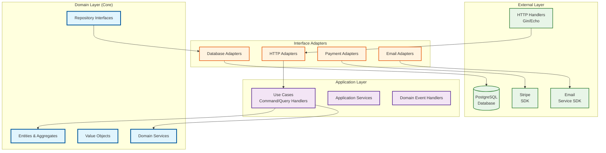

# 3. Structure Blueprint - Clean Architecture Implementation

## 3.1 Clean Architecture Layers in Go

The implementation synthesizes Domain-Driven Design with Clean Architecture principles, adapted for Go's conventions:



## 3.2 Bounded Context Implementation Structure

### 3.2.1 Reservations & Booking Context (Core Domain)

```text
internal/reservation/
├── domain/                           # Domain Layer
│   ├── entity/
│   │   ├── reservation.go            # Reservation aggregate root
│   │   ├── booking.go                # Booking entity
│   │   └── aggregate.go              # Base aggregate interface
│   ├── valueobject/
│   │   ├── date_range.go             # Check-in/Check-out dates
│   │   ├── guest_info.go             # Guest contact information
│   │   ├── confirmation_number.go    # Unique booking identifier
│   │   ├── booking_status.go         # Reservation status
│   │   └── rate_calculation.go       # Pricing calculation
│   ├── service/
│   │   ├── booking_policy.go         # Business rules for bookings
│   │   ├── rate_calculator.go        # Pricing logic
│   │   └── availability_checker.go   # Room availability
│   ├── event/
│   │   ├── booking_created.go        # Domain events
│   │   ├── booking_confirmed.go
│   │   └── booking_cancelled.go
│   ├── repository/                   # Repository interfaces
│   │   ├── reservation.go
│   │   └── booking.go
│   ├── specification/
│   │   ├── reservation_spec.go
│   │   └── composite_spec.go
│   └── saga/
│       ├── reservation_saga.go
│       └── saga_step.go
├── application/                      # Application Layer
│   ├── command/
│   │   ├── create_reservation.go
│   │   ├── confirm_booking.go
│   │   └── cancel_booking.go
│   ├── query/
│   │   ├── get_reservation.go
│   │   └── list_bookings.go
│   ├── handler/
│   │   ├── reservation_handler.go    # Command/Query handlers
│   │   └── booking_handler.go
│   ├── service/
│   │   └── reservation_service.go    # Application service
│   ├── projection/
│   │   └── reservation_projection.go
│   └── saga/
│       └── saga_orchestrator.go
├── infrastructure/                   # Infrastructure Layer
│   ├── persistence/
│   │   ├── postgres/
│   │   │   ├── reservation_repository.go
│   │   │   └── models.go             # Database models
│   │   └── memory/                   # In-memory implementation for testing
│   │       └── reservation_repository.go
│   ├── external/
│   │   ├── payment_adapter.go        # Stripe integration
│   │   └── notification_adapter.go   # Email service
│   ├── messaging/
│   │   └── event_publisher.go        # Event publishing
│   ├── resilience/
│   │   ├── circuit_breaker.go
│   │   └── retry_policy.go
│   └── cache/
│       └── redis_cache.go
└── presentation/                     # Presentation Layer
    ├── http/
    │   ├── handler/
    │   │   ├── reservation_handler.go # HTTP handlers
    │   │   └── middleware.go          # HTTP middleware
    │   └── router/
    │       └── reservation_routes.go  # Route definitions
    └── dto/
        ├── request/                   # Request DTOs
        │   ├── create_reservation.go
        │   └── update_reservation.go
        └── response/                  # Response DTOs
            ├── reservation.go
            └── booking.go
```

## 3.3 Domain Layer Implementation in Go

### 3.3.1 Domain Entities

```go
// internal/reservation/domain/entity/reservation.go
package entity

import (
    "time"
    "github.com/google/uuid"
    "hotel-booking/internal/reservation/domain/valueobject"
    "hotel-booking/internal/reservation/domain/event"
    "hotel-booking/internal/shared/domain"
)

// Reservation represents the aggregate root for the reservation bounded context
type Reservation struct {
    id          string
    guestID     string
    dateRange   valueobject.DateRange
    roomBooking valueobject.RoomBooking
    totalPrice  valueobject.Money
    status      valueobject.BookingStatus
    createdAt   time.Time
    updatedAt   time.Time
    version int // ADD this for optimistic locking

    // Domain events
    events []domain.Event
}

// NewReservation creates a new reservation with pending status
func NewReservation(
    guestID string,
    dateRange valueobject.DateRange,
    roomBooking valueobject.RoomBooking,
    totalPrice valueobject.Money,
) *Reservation {
    reservation := &Reservation{
        id:          uuid.New().String(),
        guestID:     guestID,
        dateRange:   dateRange,
        roomBooking: roomBooking,
        totalPrice:  totalPrice,
        status:      valueobject.BookingStatusPending,
        createdAt:   time.Now(),
        updatedAt:   time.Now(),
        events:      make([]domain.Event, 0),
    }

    // Add domain event
    reservation.AddEvent(event.NewBookingCreated(reservation.id, guestID))

    return reservation
}

// Confirm transitions the reservation to confirmed status
func (r *Reservation) Confirm() error {
    if r.status != valueobject.BookingStatusPending {
        return domain.NewValidationError("only pending reservations can be confirmed")
    }

    r.status = valueobject.BookingStatusConfirmed
    r.updatedAt = time.Now()

    // Add domain event
    r.AddEvent(event.NewBookingConfirmed(r.id))

    return nil
}

// Cancel transitions the reservation to cancelled status
func (r *Reservation) Cancel() error {
    if r.status == valueobject.BookingStatusCancelled {
        return domain.NewValidationError("reservation is already cancelled")
    }

    r.status = valueobject.BookingStatusCancelled
    r.updatedAt = time.Now()

    // Add domain event
    r.AddEvent(event.NewBookingCancelled(r.id))

    return nil
}

// ADD these methods to the existing Reservation entity

// GetVersion returns the current version for optimistic locking
func (r *Reservation) GetVersion() int {
    return r.version
}

// IncrementVersion increments version for optimistic locking
func (r *Reservation) IncrementVersion() {
    r.version++
    r.updatedAt = time.Now()
}

// CanModify checks if reservation can be modified based on business rules
func (r *Reservation) CanModify() bool {
    return r.status == valueobject.BookingStatusPending ||
           r.status == valueobject.BookingStatusConfirmed
}

// IsWithinCancellationPeriod checks if reservation can be cancelled without penalty
func (r *Reservation) IsWithinCancellationPeriod() bool {
    hoursUntilCheckIn := time.Until(r.dateRange.CheckIn()).Hours()
    return hoursUntilCheckIn > 24 // 24-hour cancellation policy
}

// AddEvent adds a domain event to the aggregate
func (r *Reservation) AddEvent(event domain.Event) {
    r.events = append(r.events, event)
}

// GetEvents returns all domain events and clears the event list
func (r *Reservation) GetEvents() []domain.Event {
    events := make([]domain.Event, len(r.events))
    copy(events, r.events)
    r.events = r.events[:0] // Clear events
    return events
}

// Getters following Go conventions
func (r *Reservation) ID() string { return r.id }
func (r *Reservation) GuestID() string { return r.guestID }
func (r *Reservation) DateRange() valueobject.DateRange { return r.dateRange }
func (r *Reservation) RoomBooking() valueobject.RoomBooking { return r.roomBooking }
func (r *Reservation) TotalPrice() valueobject.Money { return r.totalPrice }
func (r *Reservation) Status() valueobject.BookingStatus { return r.status }
func (r *Reservation) CreatedAt() time.Time { return r.createdAt }
func (r *Reservation) UpdatedAt() time.Time { return r.updatedAt }
```

### 3.3.2 Value Objects

```go
// internal/reservation/domain/valueobject/date_range.go
package valueobject

import (
    "fmt"
    "time"
)

// DateRange represents a check-in to check-out date range
type DateRange struct {
    checkIn  time.Time
    checkOut time.Time
}

// NewDateRange creates a new date range with validation
func NewDateRange(checkIn, checkOut time.Time) (DateRange, error) {
    if checkIn.After(checkOut) || checkIn.Equal(checkOut) {
        return DateRange{}, fmt.Errorf("check-out date must be after check-in date")
    }

    return DateRange{
        checkIn:  checkIn,
        checkOut: checkOut,
    }, nil
}

// OverlapsWith checks if this date range overlaps with another
func (dr DateRange) OverlapsWith(other DateRange) bool {
    return dr.checkIn.Before(other.checkOut) && dr.checkOut.After(other.checkIn)
}

// Nights returns the number of nights in the date range
func (dr DateRange) Nights() int {
    return int(dr.checkOut.Sub(dr.checkIn).Hours() / 24)
}

// Getters
func (dr DateRange) CheckIn() time.Time { return dr.checkIn }
func (dr DateRange) CheckOut() time.Time { return dr.checkOut }

// Equals compares two date ranges for equality (required for value objects)
func (dr DateRange) Equals(other DateRange) bool {
    return dr.checkIn.Equal(other.checkIn) && dr.checkOut.Equal(other.checkOut)
}

// internal/reservation/domain/valueobject/money.go
package valueobject

import (
    "fmt"
    "math/big"
)

// Money represents a monetary value with currency
type Money struct {
    amount   *big.Rat
    currency string
}

// NewMoney creates a new money value
func NewMoney(amount float64, currency string) Money {
    return Money{
        amount:   big.NewRat(int64(amount*100), 100), // Store as rational for precision
        currency: currency,
    }
}

// Add adds two money values (must be same currency)
func (m Money) Add(other Money) (Money, error) {
    if m.currency != other.currency {
        return Money{}, fmt.Errorf("cannot add different currencies")
    }

    result := new(big.Rat)
    result.Add(m.amount, other.amount)

    return Money{
        amount:   result,
        currency: m.currency,
    }, nil
}

// ToFloat returns the money amount as float64
func (m Money) ToFloat() float64 {
    f, _ := m.amount.Float64()
    return f
}

// Getters
func (m Money) Amount() *big.Rat { return new(big.Rat).Set(m.amount) }
func (m Money) Currency() string { return m.currency }

// Equals compares two money values
func (m Money) Equals(other Money) bool {
    return m.amount.Cmp(other.amount) == 0 && m.currency == other.currency
}
```

### 3.3.3 Repository Interfaces

```go
// internal/reservation/domain/repository/reservation.go
package repository

import (
    "context"
    "hotel-booking/internal/reservation/domain/entity"
)

// ReservationRepository defines the contract for reservation persistence
type ReservationRepository interface {
    // Create stores a new reservation
    Create(ctx context.Context, reservation *entity.Reservation) error

    // GetByID retrieves a reservation by its ID
    GetByID(ctx context.Context, id string) (*entity.Reservation, error)

    // Update modifies an existing reservation
    Update(ctx context.Context, reservation *entity.Reservation) error

    // Delete removes a reservation
    Delete(ctx context.Context, id string) error

    // FindByGuestID retrieves all reservations for a specific guest
    FindByGuestID(ctx context.Context, guestID string) ([]*entity.Reservation, error)

    // FindByDateRange retrieves reservations within a date range
    FindByDateRange(ctx context.Context, checkIn, checkOut time.Time) ([]*entity.Reservation, error)

    // FindBySpecification retrieves reservations matching a specification
    FindBySpecification(ctx context.Context, spec Specification, limit, offset int) ([]*entity.Reservation, error)

    // CountBySpecification counts reservations matching a specification
    CountBySpecification(ctx context.Context, spec Specification) (int64, error)
}
```

## 3.4 Application Layer Implementation

### 3.4.1 Application Services

```go
// internal/reservation/application/service/reservation_service.go
package service

import (
    "context"
    "fmt"

    "hotel-booking/internal/reservation/domain/entity"
    "hotel-booking/internal/reservation/domain/repository"
    "hotel-booking/internal/reservation/domain/service"
    "hotel-booking/internal/reservation/domain/valueobject"
    "hotel-booking/internal/shared/domain"
)

// ReservationService orchestrates reservation use cases
type ReservationService struct {
    reservationRepo   repository.ReservationRepository
    availabilityChecker service.AvailabilityChecker
    eventPublisher    domain.EventPublisher
    distributedLock   DistributedLock // ADD this dependency
    metricsCollector  MetricsCollector // ADD this dependency
}

// NewReservationService creates a new reservation service
func NewReservationService(
    reservationRepo repository.ReservationRepository,
    availabilityChecker service.AvailabilityChecker,
    eventPublisher domain.EventPublisher,
    distributedLock DistributedLock,
    metricsCollector MetricsCollector,
) *ReservationService {
    return &ReservationService{
        reservationRepo:     reservationRepo,
        availabilityChecker: availabilityChecker,
        eventPublisher:      eventPublisher,
        distributedLock:     distributedLock,
        metricsCollector:    metricsCollector,
    }
}

// CreateReservation creates a new reservation
func (s *ReservationService) CreateReservation(
    ctx context.Context,
    guestID string,
    roomTypeID string,
    checkIn, checkOut time.Time,
) (*entity.Reservation, error) {
    // Create date range value object
    dateRange, err := valueobject.NewDateRange(checkIn, checkOut)
    if err != nil {
        return nil, fmt.Errorf("invalid date range: %w", err)
    }

    // Check room availability
    available, err := s.availabilityChecker.IsRoomAvailable(ctx, roomTypeID, dateRange)
    if err != nil {
        return nil, fmt.Errorf("failed to check availability: %w", err)
    }

    if !available {
        return nil, domain.NewBusinessRuleViolation("room not available for selected dates")
    }

    // Create room booking value object
    roomBooking := valueobject.NewRoomBooking(roomTypeID, 1)

    // Calculate total price (simplified for MVP)
    totalPrice := valueobject.NewMoney(100.0, "USD") // TODO: Implement proper pricing

    // Create reservation entity
    reservation := entity.NewReservation(guestID, dateRange, roomBooking, totalPrice)

    // Persist reservation
    if err := s.reservationRepo.Create(ctx, reservation); err != nil {
        return nil, fmt.Errorf("failed to create reservation: %w", err)
    }

    // Publish domain events
    events := reservation.GetEvents()
    for _, event := range events {
        if err := s.eventPublisher.Publish(ctx, event); err != nil {
            // Log error but don't fail the operation
            // In production, consider using outbox pattern
            fmt.Printf("failed to publish event: %v\n", err)
        }
    }

    return reservation, nil
}

// ConfirmReservation confirms a pending reservation
func (s *ReservationService) ConfirmReservation(ctx context.Context, reservationID string) error {
    // Retrieve reservation
    reservation, err := s.reservationRepo.GetByID(ctx, reservationID)
    if err != nil {
        return fmt.Errorf("failed to get reservation: %w", err)
    }

    if reservation == nil {
        return domain.NewNotFoundError("reservation not found")
    }

    // Confirm reservation (domain logic)
    if err := reservation.Confirm(); err != nil {
        return err
    }

    // Persist changes
    if err := s.reservationRepo.Update(ctx, reservation); err != nil {
        return fmt.Errorf("failed to update reservation: %w", err)
    }

    // Publish domain events
    events := reservation.GetEvents()
    for _, event := range events {
        if err := s.eventPublisher.Publish(ctx, event); err != nil {
            fmt.Printf("failed to publish event: %v\n", err)
        }
    }

    return nil
}

// ADD this method to ReservationService

// CreateReservationWithLocking creates reservation with optimistic locking
func (s *ReservationService) CreateReservationWithLocking(
    ctx context.Context,
    guestID string,
    roomTypeID string,
    checkIn, checkOut time.Time,
) (*entity.Reservation, error) {
    // Create date range value object
    dateRange, err := valueobject.NewDateRange(checkIn, checkOut)
    if err != nil {
        return nil, fmt.Errorf("invalid date range: %w", err)
    }

    // Use distributed lock for room availability check
    lockKey := fmt.Sprintf("room_availability:%s:%s", roomTypeID, dateRange.String())

    lock, err := s.distributedLock.Acquire(ctx, lockKey, 30*time.Second)
    if err != nil {
        return nil, fmt.Errorf("failed to acquire lock: %w", err)
    }
    defer lock.Release(ctx)

    // Check room availability with lock held
    available, err := s.availabilityChecker.IsRoomAvailable(ctx, roomTypeID, dateRange)
    if err != nil {
        return nil, fmt.Errorf("failed to check availability: %w", err)
    }

    if !available {
        return nil, domain.NewBusinessRuleViolation("room not available for selected dates")
    }

    // Rest of implementation...
}
```

### 3.4.2 Command and Query Handlers

```go
// internal/reservation/application/command/create_reservation.go
package command

import (
    "time"
)

// CreateReservationCommand represents the command to create a reservation
type CreateReservationCommand struct {
    GuestID    string    `json:"guest_id" validate:"required"`
    RoomTypeID string    `json:"room_type_id" validate:"required"`
    CheckIn    time.Time `json:"check_in" validate:"required"`
    CheckOut   time.Time `json:"check_out" validate:"required"`
}

// internal/reservation/application/handler/reservation_handler.go
package handler

import (
    "context"

    "hotel-booking/internal/reservation/application/command"
    "hotel-booking/internal/reservation/application/query"
    "hotel-booking/internal/reservation/application/service"
    "hotel-booking/internal/reservation/domain/entity"
)

// ReservationHandler handles reservation commands and queries
type ReservationHandler struct {
    reservationService *service.ReservationService
}

// NewReservationHandler creates a new reservation handler
func NewReservationHandler(reservationService *service.ReservationService) *ReservationHandler {
    return &ReservationHandler{
        reservationService: reservationService,
    }
}

// HandleCreateReservation handles the create reservation command
func (h *ReservationHandler) HandleCreateReservation(
    ctx context.Context,
    cmd command.CreateReservationCommand,
) (*entity.Reservation, error) {
    return h.reservationService.CreateReservation(
        ctx,
        cmd.GuestID,
        cmd.RoomTypeID,
        cmd.CheckIn,
        cmd.CheckOut,
    )
}

// HandleConfirmReservation handles the confirm reservation command
func (h *ReservationHandler) HandleConfirmReservation(
    ctx context.Context,
    reservationID string,
) error {
    return h.reservationService.ConfirmReservation(ctx, reservationID)
}

// HandleGetReservation handles the get reservation query
func (h *ReservationHandler) HandleGetReservation(
    ctx context.Context,
    qry query.GetReservationQuery,
) (*entity.Reservation, error) {
    return h.reservationService.GetReservation(ctx, qry.ReservationID)
}
```

## 3.5 Infrastructure Layer Implementation

### 3.5.1 Database Repository Implementation

```go
// internal/reservation/infrastructure/persistence/postgres/reservation_repository.go
package postgres

import (
    "context"
    "database/sql"
    "fmt"
    "time"

    "gorm.io/gorm"

    "hotel-booking/internal/reservation/domain/entity"
    "hotel-booking/internal/reservation/domain/repository"
    "hotel-booking/internal/reservation/domain/valueobject"
    "hotel-booking/internal/shared/domain"
)

// ADD this interface to the existing repository package
type Specification interface {
    ToSQL() (string, []interface{})
    IsSatisfiedBy(reservation *entity.Reservation) bool
}

// ReservationModel represents the database model for reservations
type ReservationModel struct {
    ID           string    `gorm:"primaryKey;type:uuid"`
    GuestID      string    `gorm:"type:uuid;not null"`
    RoomTypeID   string    `gorm:"type:uuid;not null"`
    CheckIn      time.Time `gorm:"not null"`
    CheckOut     time.Time `gorm:"not null"`
    TotalAmount  float64   `gorm:"not null"`
    Currency     string    `gorm:"type:varchar(3);not null"`
    Status       string    `gorm:"type:varchar(20);not null"`
    CreatedAt    time.Time
    UpdatedAt    time.Time
    Version      int       `gorm:"not null;default:1"` // ADD this field
}

// TableName specifies the table name for GORM
func (ReservationModel) TableName() string {
    return "reservation.reservations"
}

// PostgresReservationRepository implements the reservation repository using PostgreSQL
type PostgresReservationRepository struct {
    db *gorm.DB
}

// NewPostgresReservationRepository creates a new PostgreSQL reservation repository
func NewPostgresReservationRepository(db *gorm.DB) repository.ReservationRepository {
    return &PostgresReservationRepository{db: db}
}

// Create stores a new reservation
func (r *PostgresReservationRepository) Create(ctx context.Context, reservation *entity.Reservation) error {
    model := r.entityToModel(reservation)

    if err := r.db.WithContext(ctx).Create(&model).Error; err != nil {
        return fmt.Errorf("failed to create reservation: %w", err)
    }

    return nil
}

// GetByID retrieves a reservation by its ID
func (r *PostgresReservationRepository) GetByID(ctx context.Context, id string) (*entity.Reservation, error) {
    var model ReservationModel

    err := r.db.WithContext(ctx).Where("id = ?", id).First(&model).Error
    if err != nil {
        if err == gorm.ErrRecordNotFound {
            return nil, nil
        }
        return nil, fmt.Errorf("failed to get reservation: %w", err)
    }

    return r.modelToEntity(model)
}

// Update modifies an existing reservation with optimistic locking
func (r *PostgresReservationRepository) Update(ctx context.Context, reservation *entity.Reservation) error {
    model := r.entityToModel(reservation)

    // Optimistic locking check
    result := r.db.WithContext(ctx).
        Where("id = ? AND version = ?", model.ID, model.Version-1).
        Updates(&model)

    if result.Error != nil {
        return fmt.Errorf("failed to update reservation: %w", result.Error)
    }

    if result.RowsAffected == 0 {
        return domain.NewConcurrencyError("reservation was modified by another process")
    }

    return nil
}

// ADD this method to the existing PostgresReservationRepository
func (r *PostgresReservationRepository) FindBySpecification(
    ctx context.Context,
    spec Specification,
    limit, offset int,
) ([]*entity.Reservation, error) {
    sql, args := spec.ToSQL()

    var models []ReservationModel
    query := r.db.WithContext(ctx).Where(sql, args...)

    if limit > 0 {
        query = query.Limit(limit)
    }
    if offset > 0 {
        query = query.Offset(offset)
    }

    if err := query.Find(&models).Error; err != nil {
        return nil, fmt.Errorf("failed to find reservations by specification: %w", err)
    }

    reservations := make([]*entity.Reservation, len(models))
    for i, model := range models {
        reservation, err := r.modelToEntity(model)
        if err != nil {
            return nil, err
        }
        reservations[i] = reservation
    }

    return reservations, nil
}

// ADD count method for pagination
func (r *PostgresReservationRepository) CountBySpecification(
    ctx context.Context,
    spec Specification,
) (int64, error) {
    sql, args := spec.ToSQL()

    var count int64
    if err := r.db.WithContext(ctx).Model(&ReservationModel{}).
        Where(sql, args...).Count(&count).Error; err != nil {
        return 0, fmt.Errorf("failed to count reservations: %w", err)
    }

    return count, nil
}

// FindByGuestID retrieves all reservations for a specific guest
func (r *PostgresReservationRepository) FindByGuestID(ctx context.Context, guestID string) ([]*entity.Reservation, error) {
    var models []ReservationModel

    if err := r.db.WithContext(ctx).Where("guest_id = ?", guestID).Find(&models).Error; err != nil {
        return nil, fmt.Errorf("failed to find reservations by guest ID: %w", err)
    }

    reservations := make([]*entity.Reservation, len(models))
    for i, model := range models {
        reservation, err := r.modelToEntity(model)
        if err != nil {
            return nil, err
        }
        reservations[i] = reservation
    }

    return reservations, nil
}

// entityToModel converts domain entity to database model
func (r *PostgresReservationRepository) entityToModel(reservation *entity.Reservation) ReservationModel {
    return ReservationModel{
        ID:          reservation.ID(),
        GuestID:     reservation.GuestID(),
        RoomTypeID:  reservation.RoomBooking().RoomTypeID(),
        CheckIn:     reservation.DateRange().CheckIn(),
        CheckOut:    reservation.DateRange().CheckOut(),
        TotalAmount: reservation.TotalPrice().ToFloat(),
        Currency:    reservation.TotalPrice().Currency(),
        Status:      string(reservation.Status()),
        CreatedAt:   reservation.CreatedAt(),
        UpdatedAt:   reservation.UpdatedAt(),
    }
}

// modelToEntity converts database model to domain entity
func (r *PostgresReservationRepository) modelToEntity(model ReservationModel) (*entity.Reservation, error) {
    dateRange, err := valueobject.NewDateRange(model.CheckIn, model.CheckOut)
    if err != nil {
        return nil, fmt.Errorf("invalid date range in database: %w", err)
    }

    roomBooking := valueobject.NewRoomBooking(model.RoomTypeID, 1)
    totalPrice := valueobject.NewMoney(model.TotalAmount, model.Currency)
    status := valueobject.BookingStatus(model.Status)

    // Reconstruct entity (simplified - in real implementation, consider using factory)
    reservation := entity.ReconstructReservation(
        model.ID,
        model.GuestID,
        dateRange,
        roomBooking,
        totalPrice,
        status,
        model.CreatedAt,
        model.UpdatedAt,
    )

    return reservation, nil
}
```

### 3.5.2 External Service Adapters

```go
// internal/billing/infrastructure/external/stripe_adapter.go
package external

import (
    "context"
    "fmt"

    "github.com/stripe/stripe-go/v75"
    "github.com/stripe/stripe-go/v75/paymentintent"

    "hotel-booking/internal/billing/domain/entity"
    "hotel-booking/internal/billing/domain/valueobject"
)

// StripeAdapter implements payment processing using Stripe
type StripeAdapter struct {
    apiKey string
}

// NewStripeAdapter creates a new Stripe adapter
func NewStripeAdapter(apiKey string) *StripeAdapter {
    stripe.Key = apiKey
    return &StripeAdapter{apiKey: apiKey}
}

// CreatePaymentIntent creates a new payment intent in Stripe
func (s *StripeAdapter) CreatePaymentIntent(
    ctx context.Context,
    amount valueobject.Money,
    reservationID string,
) (*entity.PaymentIntent, error) {
    params := &stripe.PaymentIntentParams{
        Amount:   stripe.Int64(int64(amount.ToFloat() * 100)), // Convert to cents
        Currency: stripe.String(amount.Currency()),
        Metadata: map[string]string{
            "reservation_id": reservationID,
        },
    }

    pi, err := paymentintent.New(params)
    if err != nil {
        return nil, fmt.Errorf("failed to create Stripe payment intent: %w", err)
    }

    // Convert Stripe payment intent to domain entity
    paymentIntent := entity.NewPaymentIntent(
        pi.ID,
        reservationID,
        amount,
        valueobject.PaymentStatusPending,
    )

    return paymentIntent, nil
}

// ConfirmPaymentIntent confirms a payment intent
func (s *StripeAdapter) ConfirmPaymentIntent(
    ctx context.Context,
    paymentIntentID string,
) error {
    params := &stripe.PaymentIntentConfirmParams{}

    _, err := paymentintent.Confirm(paymentIntentID, params)
    if err != nil {
        return fmt.Errorf("failed to confirm Stripe payment intent: %w", err)
    }

    return nil
}
```

## 3.6 Presentation Layer Implementation

### 3.6.1 HTTP Handlers

```go
// internal/reservation/presentation/http/handler/reservation_handler.go
package handler

import (
    "net/http"
    "time"

    "github.com/gin-gonic/gin"

    "hotel-booking/internal/reservation/application/command"
    "hotel-booking/internal/reservation/application/handler"
    "hotel-booking/internal/reservation/presentation/dto/request"
    "hotel-booking/internal/reservation/presentation/dto/response"
)

// ReservationHTTPHandler handles HTTP requests for reservations
type ReservationHTTPHandler struct {
    reservationHandler *handler.ReservationHandler
}

// NewReservationHTTPHandler creates a new HTTP handler
func NewReservationHTTPHandler(reservationHandler *handler.ReservationHandler) *ReservationHTTPHandler {
    return &ReservationHTTPHandler{
        reservationHandler: reservationHandler,
    }
}

// CreateReservation handles POST /reservations with enhanced validation
func (h *ReservationHTTPHandler) CreateReservation(c *gin.Context) {
    var req request.CreateReservationRequest

    if err := c.ShouldBindJSON(&req); err != nil {
        c.JSON(http.StatusBadRequest, gin.H{"error": err.Error()})
        return
    }

    // ADD comprehensive validation
    if err := req.Validate(); err != nil {
        c.JSON(http.StatusBadRequest, gin.H{"error": err.Error()})
        return
    }

    // ADD rate limiting check
    clientIP := c.ClientIP()
    if !h.rateLimiter.Allow(clientIP) {
        c.JSON(http.StatusTooManyRequests, gin.H{"error": "rate limit exceeded"})
        return
    }

    // ADD correlation ID for tracing
    correlationID := c.GetString("correlation_id")
    ctx := context.WithValue(c.Request.Context(), "correlation_id", correlationID)

    // Convert to command
    cmd := command.CreateReservationCommand{
        GuestID:    req.GuestID,
        RoomTypeID: req.RoomTypeID,
        CheckIn:    req.CheckIn,
        CheckOut:   req.CheckOut,
    }

    // Handle command with enhanced error handling
    reservation, err := h.reservationHandler.HandleCreateReservation(ctx, cmd)
    if err != nil {
        // ADD structured error handling
        switch err.(type) {
        case *domain.ValidationError:
            c.JSON(http.StatusBadRequest, gin.H{"error": err.Error(), "type": "validation_error"})
        case *domain.BusinessRuleViolation:
            c.JSON(http.StatusConflict, gin.H{"error": err.Error(), "type": "business_rule_violation"})
        case *domain.ConcurrencyError:
            c.JSON(http.StatusConflict, gin.H{"error": err.Error(), "type": "concurrency_error"})
        default:
            h.logger.Error("Internal server error", zap.Error(err), zap.String("correlation_id", correlationID))
            c.JSON(http.StatusInternalServerError, gin.H{"error": "internal server error"})
        }
        return
    }

    // Convert to response DTO
    resp := response.FromReservationEntity(reservation)

    c.JSON(http.StatusCreated, resp)
}

// GetReservation handles GET /reservations/:id with caching
func (h *ReservationHTTPHandler) GetReservation(c *gin.Context) {
    reservationID := c.Param("id")

    // ADD cache check
    cacheKey := fmt.Sprintf("reservation:%s", reservationID)
    if cachedResp, err := h.cache.Get(c.Request.Context(), cacheKey); err == nil {
        var resp response.ReservationResponse
        if json.Unmarshal([]byte(cachedResp), &resp) == nil {
            c.Header("X-Cache", "HIT")
            c.JSON(http.StatusOK, resp)
            return
        }
    }

    qry := query.GetReservationQuery{
        ReservationID: reservationID,
    }

    reservation, err := h.reservationHandler.HandleGetReservation(c.Request.Context(), qry)
    if err != nil {
        switch err.(type) {
        case *domain.NotFoundError:
            c.JSON(http.StatusNotFound, gin.H{"error": "reservation not found"})
        default:
            c.JSON(http.StatusInternalServerError, gin.H{"error": "internal server error"})
        }
        return
    }

    resp := response.FromReservationEntity(reservation)

    // ADD cache storage
    if respBytes, err := json.Marshal(resp); err == nil {
        h.cache.Set(c.Request.Context(), cacheKey, string(respBytes), 5*time.Minute)
    }

    c.Header("X-Cache", "MISS")
    c.JSON(http.StatusOK, resp)
}

// ConfirmReservation handles PUT /reservations/:id/confirm
func (h *ReservationHTTPHandler) ConfirmReservation(c *gin.Context) {
    reservationID := c.Param("id")

    err := h.reservationHandler.HandleConfirmReservation(c.Request.Context(), reservationID)
    if err != nil {
        switch err.(type) {
        case *domain.NotFoundError:
            c.JSON(http.StatusNotFound, gin.H{"error": "reservation not found"})
        case *domain.ValidationError:
            c.JSON(http.StatusBadRequest, gin.H{"error": err.Error()})
        default:
            c.JSON(http.StatusInternalServerError, gin.H{"error": "internal server error"})
        }
        return
    }

    c.JSON(http.StatusOK, gin.H{"message": "reservation confirmed"})
}

// ListReservations handles GET /reservations with filtering and pagination
func (h *ReservationHTTPHandler) ListReservations(c *gin.Context) {
    var req request.ListReservationsRequest

    if err := c.ShouldBindQuery(&req); err != nil {
        c.JSON(http.StatusBadRequest, gin.H{"error": err.Error()})
        return
    }

    if err := req.Validate(); err != nil {
        c.JSON(http.StatusBadRequest, gin.H{"error": err.Error()})
        return
    }

    // ADD rate limiting check
    clientIP := c.ClientIP()
    if !h.rateLimiter.Allow(clientIP) {
        c.JSON(http.StatusTooManyRequests, gin.H{"error": "rate limit exceeded"})
        return
    }

    // Convert to query
    qry := query.ListReservationsQuery{
        GuestID:     req.GuestID,
        Status:      req.Status,
        CheckInFrom: req.CheckInFrom,
        CheckInTo:   req.CheckInTo,
        Page:        req.Page,
        PageSize:    req.PageSize,
        SortBy:      req.SortBy,
        SortOrder:   req.SortOrder,
    }

    // Handle query
    result, err := h.reservationHandler.HandleListReservations(c.Request.Context(), qry)
    if err != nil {
        h.logger.Error("Failed to list reservations", zap.Error(err))
        c.JSON(http.StatusInternalServerError, gin.H{"error": "internal server error"})
        return
    }

    c.JSON(http.StatusOK, result)
}

```

### 3.6.2 DTOs (Data Transfer Objects)

```go
// internal/reservation/presentation/dto/request/create_reservation.go
package request

import (
    "fmt"
    "time"
)

// CreateReservationRequest represents the request to create a reservation
type CreateReservationRequest struct {
    GuestID    string    `json:"guest_id" binding:"required"`
    RoomTypeID string    `json:"room_type_id" binding:"required"`
    CheckIn    time.Time `json:"check_in" binding:"required"`
    CheckOut   time.Time `json:"check_out" binding:"required"`
}

// Validate validates the create reservation request
func (r *CreateReservationRequest) Validate() error {
    if r.CheckIn.After(r.CheckOut) || r.CheckIn.Equal(r.CheckOut) {
        return fmt.Errorf("check-out date must be after check-in date")
    }

    if r.CheckIn.Before(time.Now().Truncate(24 * time.Hour)) {
        return fmt.Errorf("check-in date cannot be in the past")
    }

    return nil
}

// internal/reservation/presentation/dto/request/list_reservations.go
package request

import (
    "fmt"
    "time"
)

type ListReservationsRequest struct {
    GuestID    string     `form:"guest_id"`
    Status     string     `form:"status"`
    CheckInFrom *time.Time `form:"check_in_from" time_format:"2006-01-02"`
    CheckInTo   *time.Time `form:"check_in_to" time_format:"2006-01-02"`
    Page       int        `form:"page" binding:"min=1"`
    PageSize   int        `form:"page_size" binding:"min=1,max=100"`
    SortBy     string     `form:"sort_by"`
    SortOrder  string     `form:"sort_order" binding:"oneof=asc desc"`
}

func (r *ListReservationsRequest) Validate() error {
    if r.Page <= 0 {
        r.Page = 1
    }
    if r.PageSize <= 0 {
        r.PageSize = 20
    }
    if r.PageSize > 100 {
        r.PageSize = 100
    }
    if r.SortOrder == "" {
        r.SortOrder = "desc"
    }
    if r.SortBy == "" {
        r.SortBy = "created_at"
    }

    if r.CheckInFrom != nil && r.CheckInTo != nil && r.CheckInFrom.After(*r.CheckInTo) {
        return fmt.Errorf("check_in_from must be before check_in_to")
    }

    return nil
}

// internal/reservation/presentation/dto/response/reservation.go
package response

import (
    "time"

    "hotel-booking/internal/reservation/domain/entity"
)

// ReservationResponse represents the reservation response
type ReservationResponse struct {
    ID          string    `json:"id"`
    GuestID     string    `json:"guest_id"`
    RoomTypeID  string    `json:"room_type_id"`
    CheckIn     time.Time `json:"check_in"`
    CheckOut    time.Time `json:"check_out"`
    TotalAmount float64   `json:"total_amount"`
    Currency    string    `json:"currency"`
    Status      string    `json:"status"`
    CreatedAt   time.Time `json:"created_at"`
    UpdatedAt   time.Time `json:"updated_at"`
}

// FromReservationEntity converts a reservation entity to response DTO
func FromReservationEntity(reservation *entity.Reservation) ReservationResponse {
    return ReservationResponse{
        ID:          reservation.ID(),
        GuestID:     reservation.GuestID(),
        RoomTypeID:  reservation.RoomBooking().RoomTypeID(),
        CheckIn:     reservation.DateRange().CheckIn(),
        CheckOut:    reservation.DateRange().CheckOut(),
        TotalAmount: reservation.TotalPrice().ToFloat(),
        Currency:    reservation.TotalPrice().Currency(),
        Status:      string(reservation.Status()),
        CreatedAt:   reservation.CreatedAt(),
        UpdatedAt:   reservation.UpdatedAt(),
    }
}

// internal/reservation/presentation/dto/response/paginated_reservations.go
package response

type PaginatedReservationsResponse struct {
    Data       []ReservationResponse `json:"data"`
    Pagination PaginationInfo        `json:"pagination"`
}

type PaginationInfo struct {
    Page       int   `json:"page"`
    PageSize   int   `json:"page_size"`
    TotalItems int64 `json:"total_items"`
    TotalPages int   `json:"total_pages"`
    HasNext    bool  `json:"has_next"`
    HasPrev    bool  `json:"has_prev"`
}

func NewPaginatedReservationsResponse(
    reservations []*entity.Reservation,
    page, pageSize int,
    totalItems int64,
) PaginatedReservationsResponse {
    data := make([]ReservationResponse, len(reservations))
    for i, reservation := range reservations {
        data[i] = FromReservationEntity(reservation)
    }

    totalPages := int((totalItems + int64(pageSize) - 1) / int64(pageSize))

    return PaginatedReservationsResponse{
        Data: data,
        Pagination: PaginationInfo{
            Page:       page,
            PageSize:   pageSize,
            TotalItems: totalItems,
            TotalPages: totalPages,
            HasNext:    page < totalPages,
            HasPrev:    page > 1,
        },
    }
}
```

## 3.7 Shared Infrastructure and Utilities

### 3.7.1 Shared Domain Types

```go
// internal/shared/domain/errors.go
package domain

import "fmt"

// DomainError represents a domain-specific error
type DomainError struct {
    Type    string
    Message string
}

func (e *DomainError) Error() string {
    return fmt.Sprintf("%s: %s", e.Type, e.Message)
}

// ValidationError represents a validation error
type ValidationError struct {
    *DomainError
}

func NewValidationError(message string) *ValidationError {
    return &ValidationError{
        DomainError: &DomainError{
            Type:    "ValidationError",
            Message: message,
        },
    }
}

// BusinessRuleViolation represents a business rule violation
type BusinessRuleViolation struct {
    *DomainError
}

func NewBusinessRuleViolation(message string) *BusinessRuleViolation {
    return &BusinessRuleViolation{
        DomainError: &DomainError{
            Type:    "BusinessRuleViolation",
            Message: message,
        },
    }
}

// NotFoundError represents a not found error
type NotFoundError struct {
    *DomainError
}

func NewNotFoundError(message string) *NotFoundError {
    return &NotFoundError{
        DomainError: &DomainError{
            Type:    "NotFoundError",
            Message: message,
        },
    }
}

// ADD this new error type

// ConcurrencyError represents a concurrency conflict error
type ConcurrencyError struct {
    *DomainError
}

func NewConcurrencyError(message string) *ConcurrencyError {
    return &ConcurrencyError{
        DomainError: &DomainError{
            Type:    "ConcurrencyError",
            Message: message,
        },
    }
}

// internal/shared/domain/events.go
package domain

import (
    "time"

    "github.com/google/uuid"
)

// Event represents a domain event
type Event interface {
    EventID() string
    EventType() string
    OccurredOn() time.Time
    AggregateID() string
}

// BaseEvent provides common event functionality
type BaseEvent struct {
    eventID     string
    eventType   string
    occurredOn  time.Time
    aggregateID string
}

// NewBaseEvent creates a new base event
func NewBaseEvent(eventType, aggregateID string) BaseEvent {
    return BaseEvent{
        eventID:     uuid.New().String(),
        eventType:   eventType,
        occurredOn:  time.Now(),
        aggregateID: aggregateID,
    }
}

func (e BaseEvent) EventID() string     { return e.eventID }
func (e BaseEvent) EventType() string   { return e.eventType }
func (e BaseEvent) OccurredOn() time.Time { return e.occurredOn }
func (e BaseEvent) AggregateID() string { return e.aggregateID }

// EventPublisher defines the contract for publishing domain events
type EventPublisher interface {
    Publish(ctx context.Context, event Event) error
}
```

### 3.7.2 Database Configuration and Connection

```go
// internal/shared/infrastructure/database/connection.go
package database

import (
    "fmt"
    "log"
    "time"

    "gorm.io/driver/postgres"
    "gorm.io/gorm"
    "gorm.io/gorm/logger"
)

// Config holds database configuration
type Config struct {
    Host         string `mapstructure:"host"`
    Port         int    `mapstructure:"port"`
    User         string `mapstructure:"user"`
    Password     string `mapstructure:"password"`
    DatabaseName string `mapstructure:"database_name"`
    SSLMode      string `mapstructure:"ssl_mode"`
    MaxOpenConns int    `mapstructure:"max_open_conns"`
    MaxIdleConns int    `mapstructure:"max_idle_conns"`
    MaxLifetime  int    `mapstructure:"max_lifetime"`
}

// NewConnection creates a new database connection
func NewConnection(config Config) (*gorm.DB, error) {
    dsn := fmt.Sprintf(
        "host=%s port=%d user=%s password=%s dbname=%s sslmode=%s",
        config.Host,
        config.Port,
        config.User,
        config.Password,
        config.DatabaseName,
        config.SSLMode,
    )

    db, err := gorm.Open(postgres.Open(dsn), &gorm.Config{
        Logger: logger.Default.LogMode(logger.Info),
    })
    if err != nil {
        return nil, fmt.Errorf("failed to connect to database: %w", err)
    }

    sqlDB, err := db.DB()
    if err != nil {
        return nil, fmt.Errorf("failed to get underlying sql.DB: %w", err)
    }

    // Set connection pool settings
    sqlDB.SetMaxOpenConns(config.MaxOpenConns)
    sqlDB.SetMaxIdleConns(config.MaxIdleConns)
    sqlDB.SetConnMaxLifetime(time.Duration(config.MaxLifetime) * time.Minute)

    // Test connection
    if err := sqlDB.Ping(); err != nil {
        return nil, fmt.Errorf("failed to ping database: %w", err)
    }

    log.Println("Database connection established successfully")
    return db, nil
}
```

## 3.8 Application Entry Point and Dependency Injection

### 3.8.1 Main Application

```go
// cmd/api/main.go
package main

import (
    "log"
    "os"

    "hotel-booking/internal/shared/infrastructure/config"
    "hotel-booking/internal/shared/infrastructure/database"
    "hotel-booking/internal/shared/infrastructure/server"
)

func main() {
    // Load configuration
    cfg, err := config.Load()
    if err != nil {
        log.Fatalf("Failed to load configuration: %v", err)
    }

    // Setup database connection
    db, err := database.NewConnection(cfg.Database)
    if err != nil {
        log.Fatalf("Failed to connect to database: %v", err)
    }

    // Setup dependency injection container
    container, err := setupDependencies(db, cfg)
    if err != nil {
        log.Fatalf("Failed to setup dependencies: %v", err)
    }

    // Setup and start HTTP server
    srv := server.NewHTTPServer(cfg.Server, container)

    log.Printf("Starting server on port %d", cfg.Server.Port)
    if err := srv.Start(); err != nil {
        log.Fatalf("Failed to start server: %v", err)
    }
}

func setupDependencies(db *gorm.DB, cfg *config.Config) (*container.Container, error) {
    // This would typically use a DI framework like Wire
    // For simplicity, showing manual dependency injection

    container := container.New()

    // Setup repositories
    reservationRepo := postgres.NewPostgresReservationRepository(db)

    // Setup external adapters
    stripeAdapter := external.NewStripeAdapter(cfg.Stripe.APIKey)
    emailAdapter := external.NewEmailAdapter(cfg.Email.APIKey)

    // Setup event publisher
    eventPublisher := messaging.NewInMemoryEventPublisher()

    // Setup domain services
    availabilityChecker := service.NewAvailabilityChecker(reservationRepo)

    // ADD circuit breaker for external services
    circuitBreaker := resilience.NewCircuitBreaker(
        cfg.CircuitBreaker.MaxFailures,
        cfg.CircuitBreaker.Timeout,
    )

    // ADD metrics collector
    metricsCollector := metrics.NewPrometheusCollector()

    // ADD distributed lock (Redis-based)
    distributedLock := lock.NewRedisDistributedLock(redisClient)

    // ADD rate limiter
    rateLimiter := ratelimit.NewTokenBucketLimiter(
        cfg.RateLimit.RequestsPerSecond,
        cfg.RateLimit.BurstSize,
    )

    // UPDATE existing services to include new dependencies
    reservationService := service.NewReservationService(
        reservationRepo,
        availabilityChecker,
        eventPublisher,
        distributedLock,
        metricsCollector,
    )

    // Setup handlers
    reservationHandler := handler.NewReservationHandler(reservationService)

    // Setup HTTP handlers
    reservationHTTPHandler := httphandler.NewReservationHTTPHandler(reservationHandler)

    // Register in container
    container.RegisterReservationHTTPHandler(reservationHTTPHandler)

    return container, nil
}
```

### 3.8.2 HTTP Server Setup

```go
// internal/shared/infrastructure/server/http_server.go
package server

import (
    "context"
    "fmt"
    "net/http"
    "os"
    "os/signal"
    "syscall"
    "time"

    "github.com/gin-gonic/gin"

    "hotel-booking/internal/shared/infrastructure/container"
)

// HTTPServer represents the HTTP server
type HTTPServer struct {
    server    *http.Server
    router    *gin.Engine
    container *container.Container
}

// Config holds server configuration
type Config struct {
    Port            int           `mapstructure:"port"`
    ReadTimeout     time.Duration `mapstructure:"read_timeout"`
    WriteTimeout    time.Duration `mapstructure:"write_timeout"`
    ShutdownTimeout time.Duration `mapstructure:"shutdown_timeout"`
}

// NewHTTPServer creates a new HTTP server
func NewHTTPServer(config Config, container *container.Container) *HTTPServer {
    router := gin.New()

    // Add middleware
    router.Use(gin.Logger())
    router.Use(gin.Recovery())

    server := &http.Server{
        Addr:         fmt.Sprintf(":%d", config.Port),
        Handler:      router,
        ReadTimeout:  config.ReadTimeout,
        WriteTimeout: config.WriteTimeout,
    }

    httpServer := &HTTPServer{
        server:    server,
        router:    router,
        container: container,
    }

    // Setup routes
    httpServer.setupRoutes()

    return httpServer
}

// setupRoutes configures API routes
func (s *HTTPServer) setupRoutes() {
    // ADD comprehensive middleware stack
    s.router.Use(middleware.RequestID())
    s.router.Use(middleware.CorrelationID())
    s.router.Use(middleware.Logging(s.container.Logger()))
    s.router.Use(middleware.Metrics(s.container.MetricsCollector()))
    s.router.Use(middleware.Recovery())
    s.router.Use(middleware.CORS(s.container.Config().Server.CORS))
    s.router.Use(middleware.RateLimit(s.container.RateLimiter()))
    s.router.Use(middleware.Timeout(30 * time.Second))

    api := s.router.Group("/api/v1")

    // Reservation routes with enhanced functionality
    reservations := api.Group("/reservations")
    {
        handler := s.container.ReservationHTTPHandler()
        reservations.POST("", handler.CreateReservation)
        reservations.GET("", handler.ListReservations)           // ADD this route
        reservations.GET("/:id", handler.GetReservation)
        reservations.PUT("/:id/confirm", handler.ConfirmReservation)
        reservations.PUT("/:id/cancel", handler.CancelReservation)  // ADD this route
        reservations.PUT("/:id", handler.UpdateReservation)        // ADD this route
    }

    // ADD webhook endpoints
    webhooks := api.Group("/webhooks")
    {
        webhooks.POST("/stripe", s.container.StripeWebhookHandler().HandleWebhook)
    }

    // ADD admin endpoints
    admin := api.Group("/admin")
    admin.Use(middleware.AdminAuth()) // ADD admin authentication
    {
        admin.GET("/reservations/stats", s.container.AdminHandler().GetReservationStats)
        admin.GET("/health/detailed", s.container.HealthHandler().DetailedHealthCheck)
    }

    // Health check and metrics
    s.router.GET("/health", s.container.HealthHandler().HealthCheck)
    s.router.GET("/metrics", gin.WrapH(promhttp.Handler()))
    s.router.GET("/ready", s.container.HealthHandler().ReadinessCheck)
}

// Start starts the HTTP server with graceful shutdown
func (s *HTTPServer) Start() error {
    // Start server in a goroutine
    go func() {
        if err := s.server.ListenAndServe(); err != nil && err != http.ErrServerClosed {
            log.Fatalf("Failed to start server: %v", err)
        }
    }()

    // Wait for interrupt signal to gracefully shutdown
    quit := make(chan os.Signal, 1)
    signal.Notify(quit, syscall.SIGINT, syscall.SIGTERM)
    <-quit

    log.Println("Shutting down server...")

    // Create shutdown context with timeout
    ctx, cancel := context.WithTimeout(context.Background(), 30*time.Second)
    defer cancel()

    // Shutdown server
    if err := s.server.Shutdown(ctx); err != nil {
        return fmt.Errorf("server forced to shutdown: %w", err)
    }

    log.Println("Server shutdown complete")
    return nil
}
```
