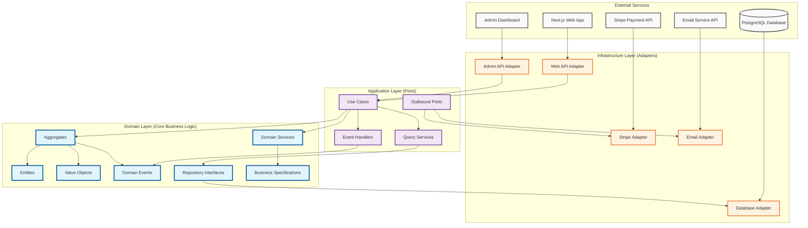

# Section 3: Structure Blueprint—Implementation Guide

## 3.1 Hexagonal Architecture Implementation

### Architecture Layer Visualization



## 3.2 Core Domain Implementation Structure

### Reservations Context (Core Domain)

```text
core/reservations/                    # @hotel/reservations
├── domain/                           # Domain Layer (Pure Business Logic)
│   ├── aggregates/
│   │   ├── reservation.aggregate.ts  # Main aggregate root
│   │   └── index.ts
│   ├── entities/
│   │   ├── room-booking.entity.ts    # Child entity within reservation
│   │   ├── guest-stay.entity.ts      # Guest stay details
│   │   └── index.ts
│   ├── value-objects/
│   │   ├── date-range.vo.ts          # Check-in/check-out dates
│   │   ├── confirmation-number.vo.ts # Unique booking identifier
│   │   ├── reservation-status.vo.ts  # Status enumeration
│   │   ├── guest-info.vo.ts          # Guest contact information
│   │   └── index.ts
│   ├── domain-services/
│   │   ├── booking-policy.service.ts # Complex booking rules
│   │   ├── rate-calculator.service.ts # Pricing calculations
│   │   ├── availability-checker.service.ts # Room availability
│   │   └── index.ts
│   ├── domain-events/
│   │   ├── reservation-created.event.ts
│   │   ├── reservation-confirmed.event.ts
│   │   ├── reservation-cancelled.event.ts
│   │   ├── payment-required.event.ts
│   │   └── index.ts
│   ├── repositories/                 # Repository Interfaces (Ports)
│   │   ├── reservation.repository.ts
│   │   ├── booking-policy.repository.ts
│   │   └── index.ts
│   ├── specifications/               # Business Rule Specifications
│   │   ├── can-book.specification.ts
│   │   ├── can-cancel.specification.ts
│   │   ├── minimum-stay.specification.ts
│   │   └── index.ts
│   └── index.ts
├── application/                      # Application Layer (Use Cases)
│   ├── use-cases/
│   │   ├── create-reservation/
│   │   │   ├── create-reservation.use-case.ts
│   │   │   ├── create-reservation.dto.ts
│   │   │   └── index.ts
│   │   ├── confirm-reservation/
│   │   │   ├── confirm-reservation.use-case.ts
│   │   │   ├── confirm-reservation.dto.ts
│   │   │   └── index.ts
│   │   ├── cancel-reservation/
│   │   ├── modify-reservation/
│   │   └── index.ts
│   ├── query-services/
│   │   ├── reservation-query.service.ts
│   │   ├── availability-query.service.ts
│   │   └── index.ts
│   ├── ports/                        # Outbound Ports
│   │   ├── room-availability.port.ts # To inventory context
│   │   ├── payment-processor.port.ts # To billing context
│   │   ├── notification-sender.port.ts # To notification context
│   │   └── index.ts
│   ├── event-handlers/
│   │   ├── payment-completed.handler.ts
│   │   ├── reservation-expired.handler.ts
│   │   └── index.ts
│   └── index.ts
├── infrastructure/                   # Infrastructure Layer (Adapters)
│   ├── persistence/
│   │   ├── reservation.repository.impl.ts
│   │   ├── event-store.repository.ts
│   │   ├── schemas/
│   │   │   ├── reservation.schema.ts # Drizzle schema
│   │   │   ├── events.schema.ts
│   │   │   └── index.ts
│   │   └── index.ts
│   ├── adapters/
│   │   ├── room-availability.adapter.ts # Inventory context integration
│   │   ├── payment-processor.adapter.ts # Billing context integration
│   │   ├── notification-sender.adapter.ts # Notification integration
│   │   └── index.ts
│   └── index.ts
└── index.ts                          # Context Public API
```

### Hotel & Room Management Context (Supporting Domain)

```text
core/inventory/                       # @hotel/inventory
├── domain/
│   ├── aggregates/
│   │   ├── room-type.aggregate.ts    # Room type with availability
│   │   ├── hotel.aggregate.ts        # Hotel configuration
│   │   └── index.ts
│   ├── entities/
│   │   ├── room.entity.ts            # Individual room
│   │   ├── amenity.entity.ts         # Hotel amenities
│   │   └── index.ts
│   ├── value-objects/
│   │   ├── room-number.vo.ts
│   │   ├── occupancy-status.vo.ts
│   │   ├── room-features.vo.ts
│   │   ├── pricing-info.vo.ts
│   │   └── index.ts
│   ├── domain-services/
│   │   ├── availability-calculator.service.ts
│   │   ├── room-assignment.service.ts
│   │   └── index.ts
│   ├── domain-events/
│   │   ├── room-type-created.event.ts
│   │   ├── availability-updated.event.ts
│   │   ├── room-blocked.event.ts
│   │   └── index.ts
│   ├── repositories/
│   │   ├── room-type.repository.ts
│   │   ├── room.repository.ts
│   │   ├── availability.repository.ts
│   │   └── index.ts
│   ├── specifications/
│   │   ├── room-available.specification.ts
│   │   └── index.ts
│   └── index.ts
├── application/
│   ├── use-cases/
│   │   ├── create-room-type/
│   │   ├── update-availability/
│   │   ├── block-rooms/
│   │   ├── assign-room/
│   │   └── index.ts
│   ├── query-services/
│   │   ├── room-type-query.service.ts
│   │   ├── availability-query.service.ts
│   │   └── index.ts
│   ├── event-handlers/
│   │   ├── reservation-confirmed.handler.ts # Update availability
│   │   ├── reservation-cancelled.handler.ts # Release rooms
│   │   └── index.ts
│   └── index.ts
├── infrastructure/
│   ├── persistence/
│   │   ├── room-type.repository.impl.ts
│   │   ├── availability.repository.impl.ts
│   │   └── schemas/
│   │       ├── room-type.schema.ts
│   │       ├── availability.schema.ts
│   │       └── index.ts
│   └── index.ts
└── index.ts
```

### Billing & Payments Context (Supporting Domain)

```text
core/billing/                         # @hotel/billing
├── domain/
│   ├── aggregates/
│   │   ├── payment.aggregate.ts      # Payment processing
│   │   ├── invoice.aggregate.ts      # Invoice generation
│   │   └── index.ts
│   ├── entities/
│   │   ├── payment-method.entity.ts
│   │   ├── refund.entity.ts
│   │   └── index.ts
│   ├── value-objects/
│   │   ├── payment-status.vo.ts
│   │   ├── payment-intent-id.vo.ts
│   │   ├── amount.vo.ts
│   │   └── index.ts
│   ├── domain-services/
│   │   ├── payment-policy.service.ts
│   │   ├── refund-calculator.service.ts
│   │   ├── tax-calculator.service.ts
│   │   └── index.ts
│   ├── domain-events/
│   │   ├── payment-initiated.event.ts
│   │   ├── payment-completed.event.ts
│   │   ├── payment-failed.event.ts
│   │   ├── refund-processed.event.ts
│   │   └── index.ts
│   ├── repositories/
│   │   ├── payment.repository.ts
│   │   ├── invoice.repository.ts
│   │   └── index.ts
│   ├── specifications/
│   │   ├── can-refund.specification.ts
│   │   ├── requires-deposit.specification.ts
│   │   └── index.ts
│   └── index.ts
├── application/
│   ├── use-cases/
│   │   ├── process-payment/
│   │   ├── handle-payment-webhook/
│   │   ├── process-refund/
│   │   ├── generate-invoice/
│   │   └── index.ts
│   ├── query-services/
│   │   ├── payment-query.service.ts
│   │   └── index.ts
│   ├── ports/
│   │   ├── payment-gateway.port.ts   # Stripe integration
│   │   └── index.ts
│   ├── event-handlers/
│   │   ├── reservation-confirmed.handler.ts # Process payment
│   │   ├── reservation-cancelled.handler.ts # Handle refunds
│   │   └── index.ts
│   └── index.ts
├── infrastructure/
│   ├── persistence/
│   │   ├── payment.repository.impl.ts
│   │   └── schemas/
│   │       ├── payment.schema.ts
│   │       └── index.ts
│   ├── adapters/
│   │   ├── stripe.adapter.ts         # Stripe payment gateway
│   │   └── index.ts
│   └── index.ts
└── index.ts
```

### Shared Kernel Implementation

```text
core/shared/                          # @hotel/shared
├── domain/
│   ├── value-objects/
│   │   ├── guest-id.vo.ts            # Shared guest identifier
│   │   ├── room-type-id.vo.ts        # Shared room type identifier
│   │   ├── money.vo.ts               # Currency and amount handling
│   │   ├── email.vo.ts               # Email validation
│   │   ├── phone.vo.ts               # Phone number validation
│   │   ├── date-range.vo.ts          # Common date operations
│   │   └── index.ts
│   ├── entities/
│   │   ├── base.entity.ts            # Base entity class
│   │   ├── aggregate-root.ts         # Base aggregate root
│   │   └── index.ts
│   ├── events/
│   │   ├── domain-event.base.ts      # Base domain event
│   │   ├── integration-event.base.ts # Cross-context events
│   │   ├── event-dispatcher.ts       # Event handling
│   │   └── index.ts
│   ├── exceptions/
│   │   ├── domain.exception.ts       # Domain-specific errors
│   │   ├── validation.exception.ts   # Validation errors
│   │   ├── business-rule.exception.ts # Business rule violations
│   │   └── index.ts
│   └── index.ts
├── application/
│   ├── patterns/
│   │   ├── use-case.base.ts          # Base use case interface
│   │   ├── query.base.ts             # Base query interface
│   │   ├── specification.base.ts     # Base specification pattern
│   │   └── index.ts
│   ├── validation/
│   │   ├── validator.service.ts      # Zod validation service
│   │   └── index.ts
│   └── index.ts
└── index.ts
```

## 3.3 Infrastructure Package Implementation

### Database Package Structure

```text
packages/database/                    # @hotel/database
├── schemas/
│   ├── reservations/
│   │   ├── reservations.schema.ts    # Reservation tables
│   │   ├── events.schema.ts          # Event store
│   │   └── index.ts
│   ├── inventory/
│   │   ├── room-types.schema.ts      # Room type tables
│   │   ├── availability.schema.ts    # Availability calendar
│   │   └── index.ts
│   ├── billing/
│   │   ├── payments.schema.ts        # Payment tables
│   │   └── index.ts
│   ├── guests/
│   │   ├── guests.schema.ts          # Guest tables
│   │   └── index.ts
│   ├── shared/
│   │   ├── audit.schema.ts           # Audit trail
│   │   ├── integration-events.schema.ts
│   │   └── index.ts
│   └── index.ts
├── migrations/
│   ├── 0001_initial_schema.sql
│   ├── 0002_add_events.sql
│   ├── 0003_add_billing.sql
│   └── index.ts
├── connection.ts                     # Database connection setup
├── migrate.ts                        # Migration runner
└── index.ts
```

### API Package Structure

```text
packages/api/                         # @hotel/api
├── routers/
│   ├── reservations.router.ts        # Reservation endpoints
│   ├── inventory.router.ts           # Room management endpoints
│   ├── billing.router.ts             # Payment endpoints
│   ├── guests.router.ts              # Guest endpoints
│   ├── admin.router.ts               # Admin endpoints
│   └── index.ts
├── middleware/
│   ├── auth.middleware.ts            # Authentication
│   ├── validation.middleware.ts      # Request validation
│   ├── error-handler.middleware.ts   # Error handling
│   ├── rate-limit.middleware.ts      # Rate limiting
│   └── index.ts
├── types/
│   ├── api-responses.ts              # Standard API responses
│   ├── pagination.ts                # Pagination types
│   └── index.ts
├── root.router.ts                    # Main tRPC router
└── index.ts
```

### Event System Package

```text
packages/events/                      # @hotel/events
├── event-bus.ts                      # Event bus interface
├── implementations/
│   ├── in-memory-event-bus.ts        # MVP implementation
│   ├── redis-event-bus.ts            # Future: Redis implementation
│   └── index.ts
├── integration-events/
│   ├── reservation-events.ts         # Cross-context reservation events
│   ├── payment-events.ts             # Cross-context payment events
│   └── index.ts
├── event-store/
│   ├── event-store.service.ts        # Event persistence
│   ├── event-projector.ts            # Event projection
│   └── index.ts
└── index.ts
```

## 3.4 Application Layer Implementation

### Next.js Application Structure

```text
apps/web/
├── src/
│   ├── app/                          # Next.js App Router
│   │   ├── (auth)/                   # Authentication routes
│   │   │   ├── login/
│   │   │   │   └── page.tsx
│   │   │   ├── register/
│   │   │   │   └── page.tsx
│   │   │   ├── forgot-password/
│   │   │   │   └── page.tsx
│   │   │   └── layout.tsx
│   │   ├── (booking)/                # Guest booking flow
│   │   │   ├── search/
│   │   │   │   └── page.tsx          # Room search
│   │   │   ├── rooms/
│   │   │   │   └── page.tsx          # Room selection
│   │   │   ├── checkout/
│   │   │   │   └── page.tsx          # Checkout & payment
│   │   │   ├── confirmation/
│   │   │   │   ├── [reservationId]/
│   │   │   │   │   └── page.tsx
│   │   │   │   └── page.tsx
│   │   │   └── layout.tsx
│   │   ├── (dashboard)/              # Admin dashboard
│   │   │   ├── reservations/
│   │   │   │   ├── page.tsx          # Reservation list
│   │   │   │   ├── [id]/
│   │   │   │   │   ├── page.tsx      # Reservation details
│   │   │   │   │   └── edit/
│   │   │   │   │       └── page.tsx
│   │   │   │   └── new/
│   │   │   │       └── page.tsx
│   │   │   ├── rooms/
│   │   │   │   ├── page.tsx          # Room management
│   │   │   │   ├── types/
│   │   │   │   │   ├── page.tsx      # Room types
│   │   │   │   │   └── [id]/
│   │   │   │   │       └── page.tsx
│   │   │   │   └── availability/
│   │   │   │       └── page.tsx      # Availability calendar
│   │   │   ├── guests/
│   │   │   │   ├── page.tsx          # Guest list
│   │   │   │   └── [id]/
│   │   │   │       └── page.tsx
│   │   │   ├── billing/
│   │   │   │   ├── payments/
│   │   │   │   │   └── page.tsx
│   │   │   │   └── invoices/
│   │   │   │       └── page.tsx
│   │   │   ├── reports/
│   │   │   │   └── page.tsx
│   │   │   └── layout.tsx
│   │   ├── api/                      # API routes
│   │   │   ├── trpc/
│   │   │   │   └── [trpc]/
│   │   │   │       └── route.ts      # tRPC handler
│   │   │   ├── webhooks/
│   │   │   │   ├── stripe/
│   │   │   │   │   └── route.ts      # Stripe webhooks
│   │   │   │   └── email/
│   │   │   │       └── route.ts      # Email webhooks
│   │   │   ├── auth/
│   │   │   │   ├── login/
│   │   │   │   │   └── route.ts
│   │   │   │   ├── register/
│   │   │   │   │   └── route.ts
│   │   │   │   └── refresh/
│   │   │   │       └── route.ts
│   │   │   └── health/
│   │   │       └── route.ts
│   │   ├── globals.css
│   │   ├── layout.tsx
│   │   ├── page.tsx
│   │   └── not-found.tsx
│   ├── components/                   # App-specific components
│   │   ├── booking/
│   │   │   ├── search-form.tsx
│   │   │   ├── room-card.tsx
│   │   │   ├── checkout-form.tsx
│   │   │   ├── payment-form.tsx
│   │   │   └── index.ts
│   │   ├── dashboard/
│   │   │   ├── reservation-table.tsx
│   │   │   ├── room-management.tsx
│   │   │   ├── availability-calendar.tsx
│   │   │   ├── stats-cards.tsx
│   │   │   └── index.ts
│   │   ├── layout/
│   │   │   ├── header.tsx
│   │   │   ├── sidebar.tsx
│   │   │   ├── footer.tsx
│   │   │   └── index.ts
│   │   └── forms/
│   │       ├── guest-form.tsx
│   │       ├── room-type-form.tsx
│   │       └── index.ts
│   ├── lib/                          # Application utilities
│   │   ├── trpc/
│   │   │   ├── client.ts             # tRPC client setup
│   │   │   ├── server.ts             # tRPC server setup
│   │   │   ├── provider.tsx          # React Query provider
│   │   │   └── index.ts
│   │   ├── auth/
│   │   │   ├── auth.service.ts       # Auth service
│   │   │   ├── auth-provider.tsx     # Auth context
│   │   │   └── index.ts
│   │   ├── utils.ts                  # Utility functions
│   │   ├── constants.ts              # Application constants
│   │   └── validations.ts            # Zod schemas
│   ├── hooks/                        # App-specific hooks
│   │   ├── use-auth.ts               # Authentication state
│   │   ├── use-booking-flow.ts       # Booking flow state
│   │   ├── use-reservation.ts        # Reservation operations
│   │   └── index.ts
│   ├── types/                        # App-specific types
│   │   ├── api.types.ts              # API response types
│   │   ├── booking.types.ts          # Booking flow types
│   │   └── index.ts
│   └── middleware.ts                 # Next.js middleware
├── public/                           # Static assets
│   ├── images/
│   ├── icons/
│   └── favicon.ico
├── package.json
├── next.config.js
├── tailwind.config.js
└── tsconfig.json
```
